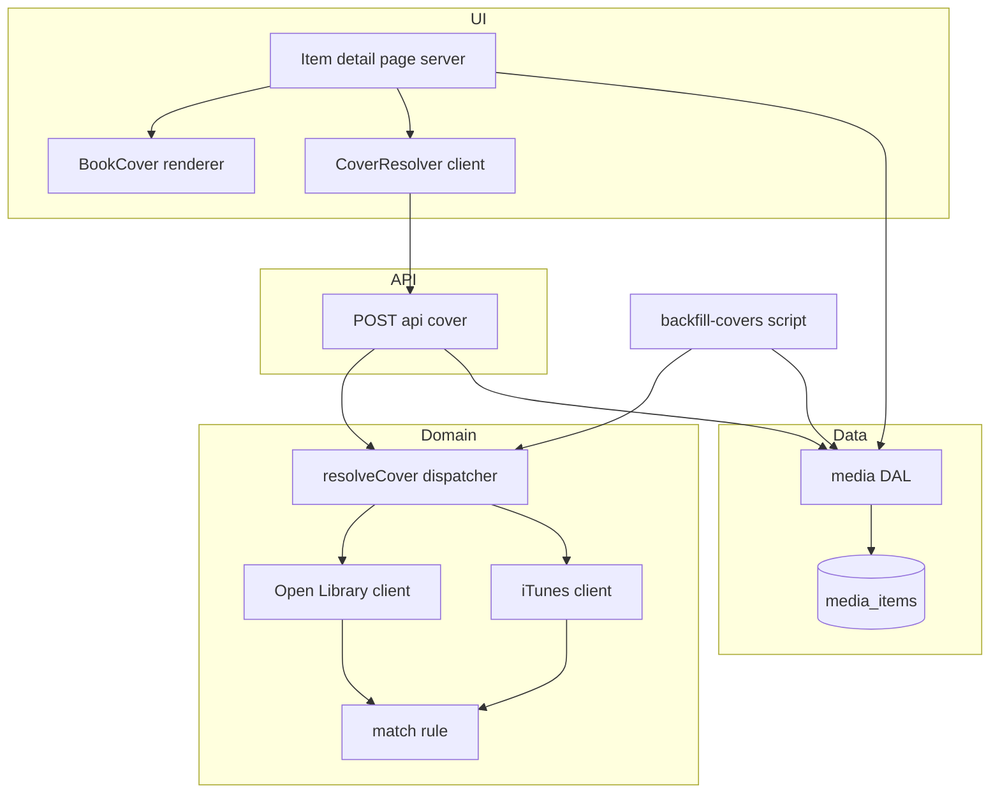

# Design Document

## Overview

**Purpose**: Show real cover art — book jackets and album/podcast/TV art — wherever an item's cover is rendered (starting with the detail page), while preserving the themed placeholder as the fallback.

**Users**: Readers browsing their library and item detail pages.

**Impact**: Adds a persisted `artwork_url` (plus a `artwork_checked_at` marker) to `media_items`; captures the artwork trending providers already supply (currently discarded on add); and resolves missing covers from two **keyless, server-side** sources — Open Library (ebooks) and the iTunes Search API (music/podcast/TV-movie). Resolution+persist run only via a client-triggered **Route Handler** and an offline **backfill script** (never during render), honoring the platform's server-read/client-mutate rule. `BookCover` becomes the single renderer that shows an `` when art exists and the themed initials otherwise.

### Goals
- Real covers on the detail page, with an unchanged themed fallback for art-less items.
- Persist trending artwork on add; resolve missing covers for seeded/custom items; never refetch once an outcome is known.
- Never display a mismatched cover; never block render or add-to-library on external calls.

### Non-Goals
- Replacing the themed placeholder design or restyling cards.
- Uploading/hosting cover images (we store external https URLs only).
- Cover selection UI or manual override.
- Resolving covers for media types without a supported source (they keep the placeholder, Req 4.7).

## Architecture

### Existing Architecture Analysis
- **Reused patterns**: timed `fetch` with `AbortSignal.timeout` + try/catch → graceful `null` (trending clients); `httpsOrNull` https validation; atomic `findOrCreateMedia`; `BookCover` themed renderer; script entrypoints via `src/db/load-env.ts` + `getDb()` (`seed.ts`).
- **Boundaries respected**: server reads via DAL in Server Components; mutations via Route Handlers; domain/API contracts in `src/lib/types`; secrets in env (these sources are keyless); https-only external media; no `dangerouslySetInnerHTML`.
- **Integration points**: `media_items` schema + `MediaItem` type; the trending add path (`TrendingCard` → `validateAddTrending` → `addTrendingItem` → `findOrCreateMedia`); the item detail page + `BookCover`.

### Architecture Pattern & Boundary Map

Selected pattern: **keyless per-type resolver clients behind one dispatcher**, invoked by a **client-triggered Route Handler** (on-demand) and an **offline script** (bulk warm) — never during Server Component render.



**Architecture Integration**:
- Selected pattern: per-type client + dispatcher (mirrors trending providers), with resolution side-effects confined to a Route Handler and a script.
- Domain boundaries: cover clients + match rule in `lib/covers` (pure except the injected fetch); persistence in the DAL; UI confined to `BookCover` + a small client trigger.
- Existing patterns preserved: timed-fetch/https-validation/graceful-null; server-read/client-mutate; `findOrCreateMedia`.
- New components rationale: a renderer image path, two keyless clients, a dispatcher+match rule, one route, one client trigger, one script.
- Steering compliance: keyless server-side fetch, https-only, no render-time writes, typed contracts.

### Technology Stack

| Layer | Choice / Version | Role in Feature | Notes |
|-------|------------------|-----------------|-------|
| Frontend | Next.js 15 RSC + React 19 | Detail page reads stored art; `BookCover` renders ``/placeholder; tiny client trigger | No `next/image` (arbitrary external hosts) — plain ``, as TrendingCard does |
| Backend | Next.js Route Handler | `POST /api/cover` resolves+persists on demand (session-gated) | Mutation surface per steering |
| Domain | TypeScript (strict) | `resolveCover` dispatcher + Open Library / iTunes clients + match rule | Injectable `fetchImpl`; `AbortSignal.timeout` |
| Data | PostgreSQL + Drizzle | `media_items.artwork_url`, `artwork_checked_at`; DAL updates | Drizzle migration via `db:generate` |
| Tooling | tsx script | `backfill-covers` warms seeded/existing rows | Throttled, idempotent; mirrors `seed.ts` |
| External | Open Library, iTunes Search | Cover sources (keyless, https) | Open Library cover-by-ID unrestricted; iTunes ≈20/min |

## System Flows

On-demand resolution for an unresolved, supported item (first view only):

```mermaid
sequenceDiagram
    participant U as Browser
    participant D as Detail page RSC
    participant C as CoverResolver client
    participant R as POST api cover
    participant V as resolveCover
    participant X as External source
    participant DB as media_items

    D->>DB: read media item
    D-->>U: render BookCover (placeholder) + CoverResolver when art-less and unchecked and supported
    C->>R: POST mediaItemId
    R->>DB: load item; bail if already checked or has art
    R->>V: resolve(item)
    V->>X: timed fetch (keyless)
    X-->>V: candidates
    V-->>R: matched https url or null
    R->>DB: set artwork_url (if matched) + artwork_checked_at = now
    R-->>C: { artworkUrl }
    C->>D: router.refresh (show image or keep placeholder)
```

Key decisions: the handler is **idempotent** (no-op if `artwork_checked_at` is set or art already present), so concurrent/duplicate triggers cost one resolution; a failure/timeout sets `artwork_checked_at` only when a definitive "no result" is known, and otherwise leaves the row eligible for a later attempt (and always degrades to the placeholder).

## Requirements Traceability

| Requirement | Summary | Components | Interfaces |
|-------------|---------|------------|------------|
| 1.1, 1.2, 1.5 | Show art / placeholder fallback / no broken image | `BookCover`, detail page | `BookCoverProps.imageUrl`, `` |
| 1.3, 1.4 | Accessible alt; https + no-referrer | `BookCover` | img attributes |
| 2.1–2.4 | Optional persisted https artwork; backward compatible | schema, `MediaItem`, DAL | `artwork_url`, `artwork_checked_at` |
| 3.1–3.4 | Capture trending art on add; fill missing; never overwrite | `validateAddTrending`, `addTrendingItem`, `findOrCreateMedia`, `TrendingCard` | add request `artworkUrl` |
| 4.1, 4.7 | Resolve per type; unsupported → placeholder | `resolveCover`, OL/iTunes clients | dispatcher |
| 4.2, 4.5 | Persist result; don't refetch once known | DAL, route, script | `artwork_checked_at` |
| 4.3, 4.4 | Server-side; keyless | route, clients | — |
| 4.6, 7.1, 7.2 | Graceful on failure/timeout; never hang render | clients, route, `CoverResolver` | `AbortSignal.timeout` |
| 5.1–5.3 | Match rule; reject ambiguous; https only | match rule, clients | `coverMatches`, `httpsOrNull` |
| 6.1–6.3 | Consistent fallback; no regression; trending unchanged | `BookCover`, surfaces | — |
| 7.3 | Don't block add on cover | `addTrendingItem`, `/api/media` | — |

## Components and Interfaces

| Component | Domain/Layer | Intent | Req | Contracts |
|-----------|--------------|--------|-----|-----------|
| `media_items` artwork columns | Data | Persist optional https art + checked marker | 2, 4.2, 4.5 | State |
| cover clients + dispatcher | lib/covers | Resolve a cover URL per media type (keyless, timed, matched) | 4, 5, 7.1 | Service |
| match rule | lib/covers | Decide if a candidate is the right item | 5 | Service |
| `POST /api/cover` | API | On-demand resolve+persist (idempotent, session-gated) | 4.2,4.3,4.5,4.6 | API |
| `CoverResolver` | UI (client) | Trigger resolution for an art-less, unchecked, supported item | 1.1,4.6 | State |
| `BookCover` (extended) | UI | Render `` when art present, else themed initials | 1, 6.1 | State |
| trending add path | lib + API + UI | Persist provider artwork on add; fill missing; never overwrite | 3 | API |
| `backfill-covers` script | Tooling | Bulk-warm seeded/existing rows (throttled, idempotent) | 4.1,4.2 | Batch |

### Data

#### media_items artwork columns
| Field | Detail |
|-------|--------|
| Intent | Persist an optional cover URL and a "resolution attempted" marker |
| Requirements | 2.1, 2.2, 2.4, 4.2, 4.5 |

**Contracts**: State [x]
- `artwork_url text` (nullable; only https stored), `artwork_checked_at timestamptz` (nullable).
- States: `checked_at IS NULL` → never attempted (eligible); `checked_at` set + `url` null → attempted, no confident match; `url` set → resolved.
- `MediaItem` gains `artworkUrl: string | null` and `artworkCheckedAt: string | null`; both optional/nullable so existing rows and inserts stay valid (Req 2.4).
- DAL: `updateMediaArtwork(db, id, { artworkUrl, checkedAt })`; `findMediaNeedingCover(db, limit)` (rows with `checked_at IS NULL` and a supported type) for the script; `findOrCreateMedia` input extends with optional `artworkUrl` / `artworkCheckedAt`.

#### Migration
- Drizzle `db:generate` adds two nullable columns — additive, no backfill in the migration itself. pglite integration tests apply it like prior migrations.

### lib/covers

#### Cover clients + dispatcher
| Field | Detail |
|-------|--------|
| Intent | Resolve a confident https cover URL for an item, or null | 
| Requirements | 4.1, 4.3, 4.4, 4.6, 4.7, 5.1, 5.3, 7.1 |

**Contracts**: Service [x]

##### Service Interface
```typescript
import type { MediaItem } from "@/lib/types";

export interface CoverDeps {
  fetchImpl?: typeof fetch;   // injectable for tests
  timeoutMs?: number;         // default ~4000 on-demand
}

// Dispatches by media type; returns a validated https cover URL or null.
// Never throws — network/parse/timeout errors resolve to null (Req 4.6).
export function resolveCover(item: Pick<MediaItem, "type" | "title" | "creator">, deps?: CoverDeps): Promise<string | null>;

// Per-source clients (used by the dispatcher; exported for tests):
export function resolveOpenLibraryCover(title: string, creator: string, deps?: CoverDeps): Promise<string | null>;
export function resolveItunesCover(title: string, creator: string, entities: readonly string[], deps?: CoverDeps): Promise<string | null>;
```
- **Type → source map**: `ebook` → Open Library; `music` → iTunes `["album"]`; `podcast` → iTunes `["podcast"]`; `tv_movie` → iTunes `["movie","tvSeason"]` (first confident match wins). Unknown type → `null` (Req 4.7).
- Preconditions: title/creator are the item's stored values. Postconditions: result is `null` or an `https://` URL that passed the match rule; for iTunes, `artworkUrl100` upscaled to `600x600bb`. Invariants: no throw; one timed request per source attempt.

**Implementation Notes**
- Integration: mirrors `src/lib/trending/{nyt,spotify}.ts` (timed fetch, `httpsOrNull`, try/catch → null); descriptive User-Agent on Open Library.
- Validation: every returned URL passes `httpsOrNull`.
- Risks: external shape drift — parsing is defensive and falls back to null.

#### Match rule
| Field | Detail |
|-------|--------|
| Intent | Accept a candidate only when it is confidently the same item | 
| Requirements | 5.1, 5.2 |

**Contracts**: Service [x]
```typescript
// True when candidate title/creator confidently match the item's.
export function coverMatches(
  item: { title: string; creator: string },
  candidate: { title: string; creator?: string | null },
  opts?: { requireCreator?: boolean },
): boolean;
```
- Normalizes both sides (lowercase, strip diacritics + punctuation, collapse whitespace). Accepts when normalized titles are equal or the candidate title strongly contains the item title, **and** creators corroborate (one contains the other) — or, when `requireCreator` is false (podcasts), a strong title match alone. Pure and fully unit-tested.

### API

#### POST /api/cover
| Field | Detail |
|-------|--------|
| Intent | Resolve + persist a cover for one item, on demand |
| Requirements | 4.2, 4.3, 4.5, 4.6 |

**Contracts**: API [x]

##### API Contract
| Method | Endpoint | Request | Response | Errors |
|--------|----------|---------|----------|--------|
| POST | /api/cover | `{ mediaItemId: string }` | `{ artworkUrl: string \| null }` | 400 invalid body, 401 unauth, 404 unknown item |

- Session-gated (`getSessionUser`). Loads the item; if it already has art or `artwork_checked_at` is set, returns the current value without an external call (idempotent, Req 4.5). Otherwise calls `resolveCover`, then `updateMediaArtwork` (set `artwork_checked_at = now`, and `artwork_url` only on a match). A resolver failure still returns `{ artworkUrl: null }` and does not 5xx (Req 4.6). Validated via the existing `validation.ts` helpers.

### UI

#### BookCover (extended) — summary-only
Add optional `imageUrl?: string | null`. When present, render an `` (`referrerPolicy="no-referrer"`, `loading="lazy"`, https, accessible label from title) that on load error swaps to the themed initials; otherwise the current themed `<div>`. Single renderer → identical fallback everywhere (Req 6.1). The detail page passes `imageUrl={item.artworkUrl}`.

#### CoverResolver (client) — summary-only
Rendered by the detail page only when the item is art-less, `artwork_checked_at` is null, and the type is supported. On mount it `POST`s to `/api/cover` once and, on a returned URL, calls `router.refresh()` to show the persisted image; on null/failure it does nothing (placeholder stays). No effect for already-resolved/checked items, so most views render zero extra requests.

### Trending add path (extend) — summary-only
- `AddTrendingRequest` / `validateAddTrending` accept optional `artworkUrl` (https-validated, else dropped).
- `TrendingCard.add()` includes `item.artworkUrl` in the POST body.
- `addTrendingItem` / `findOrCreateMedia`: persist `artworkUrl` (+ `artwork_checked_at`) on create; when an existing matched row lacks art and the trending item supplies one, fill it; never overwrite existing art (Req 3.3/3.4). Resolution lookups are **not** performed inline, so add never blocks on cover availability (Req 7.3).

### Tooling

#### backfill-covers script — summary-only
A `tsx` entrypoint (mirrors `seed.ts`: `load-env` + `getDb`) that pages `findMediaNeedingCover`, calls `resolveCover` per row with a longer timeout, persists via `updateMediaArtwork`, and **throttles** to stay under the iTunes ~20/min limit. Idempotent (skips checked rows) so it can warm seeded data and be re-run safely.

## Data Models
No new entities. `MediaItem` gains `artworkUrl: string | null` and `artworkCheckedAt: string | null`; `media_items` gains the matching nullable columns. No relationship or cardinality changes. Cover URLs are external https strings (not hosted).

## Error Handling

### Error Strategy
External calls are isolated, timed, and total: any failure resolves to "no cover" and the placeholder.

### Error Categories and Responses
- **User (4xx)**: invalid `/api/cover` body → 400; unauthenticated → 401; unknown id → 404 (validated/guarded like existing routes).
- **System/timeout (graceful)**: source down/slow/garbage → resolver returns null; route returns `{ artworkUrl: null }` (no 5xx); browser image load error → `` placeholder. Render and add-to-library never blocked.
- **Match failure (business)**: no candidate passes `coverMatches` → store no artwork (Req 5.2).

### Monitoring
Reuse existing request logging; no new telemetry.

## Testing Strategy

### Unit Tests
- `coverMatches`: exact/normalized title match, creator corroboration, rejects near-miss/unrelated, podcast title-only path.
- Open Library client (injected `fetchImpl`): builds search URL, picks `cover_i`, constructs by-ID https URL, returns null on no-match/non-200/timeout.
- iTunes client (injected `fetchImpl`): entity selection per type, `100x100bb`→`600x600bb` upscale, match + https validation, `tv_movie` movie→tvSeason fallback, null on failure.
- `resolveCover` dispatch incl. unsupported type → null.

### Integration Tests (pglite)
- Migration applies; `updateMediaArtwork` sets url + `checked_at`; `findMediaNeedingCover` selects only unchecked, supported rows.
- `findOrCreateMedia` persists `artworkUrl`; trending add fills a missing-art existing row and never overwrites existing art.
- `POST /api/cover` (with an injected/stubbed resolver): resolves+persists once, is idempotent on a checked row, returns `{ artworkUrl: null }` on resolver failure without 5xx, and requires auth.

### Component Tests
- `BookCover`: renders `` (https, no-referrer, lazy, accessible) when `imageUrl` set; themed initials otherwise; falls back on `onError`.

## Security Considerations
Cover sources are **keyless** (no secrets); all access is **server-side** via the Route Handler/script (never the browser). Only `https` image URLs are stored and rendered; images use `referrerPolicy="no-referrer"`. `/api/cover` is session-gated and validates input; it performs no user-data mutation beyond the shared catalog row's artwork fields. No `next/image` remote-host allow-listing is introduced (plain ``, consistent with TrendingCard).

## Performance & Scalability
On-demand resolution is one timed call on the first view of an unresolved item, then cached on the row (`artwork_checked_at`) so subsequent views and most page loads issue zero external calls. The backfill script throttles under the iTunes ~20/min limit and is idempotent. Open Library covers are fetched by **cover ID** (unrestricted). All external calls are `AbortSignal.timeout`-bounded so neither render nor add is ever blocked (Req 7).
