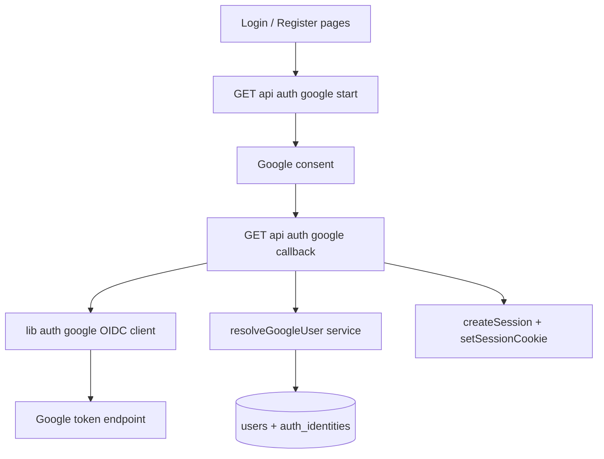
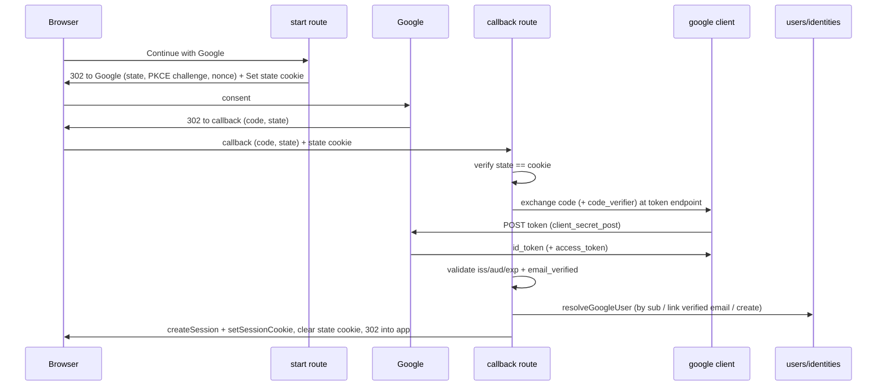

# Design Document

## Overview

**Purpose**: Add "Continue with Google" to login and registration — Google sign-in registers a member on first use and logs them in thereafter — reusing the platform's existing revocable session and SSO-ready `auth_identities` model.

**Users**: Visitors registering or signing in; existing password members who choose to use Google.

**Impact**: A minimal, hand-rolled **OIDC authorization-code (PKCE) client** plus two route handlers, a Google user-resolution service, and a conditionally-rendered button. **No schema migration** — `auth_identities` already supports the `google` provider. Email/password is untouched; the Google option is hidden when unconfigured. Adds env config (`GOOGLE_CLIENT_ID`, `GOOGLE_CLIENT_SECRET`, `GOOGLE_REDIRECT_URI`) and a Google Cloud OAuth client.

### Goals
- Register + sign in with Google, issuing the platform's normal session.
- Server-side, secret-safe OAuth with state/PKCE/nonce and ID-token claim validation.
- Auto-link to an existing member when the verified email matches; otherwise create.
- No regression to password auth; gates green; flow tested without live Google calls.

### Non-Goals
- Adopting an auth library or changing the session model.
- Storing Google access/refresh tokens or calling Google APIs beyond identity.
- Other providers; account-management UI for unlinking (future).

## Architecture

### Existing Architecture Analysis
- **Reuse**: `createSession(db, userId)` + `setSessionCookie` (session issuance), `getSessionUser`/middleware (gating), `auth_identities` (`google` provider, shape + uniqueness constraints), `registerMember`'s transaction pattern, `pickAvatarColor`, `normalizeEmail`.
- **Boundaries**: OAuth/OIDC client logic in `lib/auth/google`; user resolution in `lib/auth/service`; HTTP orchestration in two Route Handlers; UI gating on the existing login/register pages.
- **Steering**: server-read/client-mutate (OAuth is server-side route handlers), secrets in env, `nodejs` runtime, typed contracts, no `dangerouslySetInnerHTML`.

### Architecture Pattern & Boundary Map



**Architecture Integration**:
- Selected pattern: hand-rolled OIDC authorization-code + PKCE; reuse existing session/identity.
- New components: a Google OIDC client module (pure + injectable fetch), a user-resolution service function, two route handlers, a config/gate helper, and a button on existing pages.
- Steering compliance: secret + code exchange server-side only; no token persistence; revocable session parity.

## System Flows



Key decisions: state mismatch, invalid/expired token, or `email_verified=false` → reject before any DB write or session (Req 7); resolution + session happen only after a successful, validated exchange (Req 7.4).

## Requirements Traceability

| Requirement | Summary | Components |
|-------------|---------|------------|
| 1.1, 1.4 | Button on login/register; password intact | UI gating + start route |
| 1.2 | Begins authorization-code flow | start route + `buildAuthUrl` |
| 1.3 | Hidden when unconfigured | `isGoogleConfigured` |
| 2.1–2.4 | First-time register: user + google identity, no password | `resolveGoogleUser` (create) |
| 3.1–3.3 | Returning login by `sub`; session | `resolveGoogleUser` (by sub) + session |
| 4.1–4.4 | Link by verified email; preserve identities; uniqueness | `resolveGoogleUser` (link) |
| 5.1–5.5 | Server-side, env secret, state/PKCE/nonce, claim validation, allow-listed redirect, no token persistence | google client + routes + config |
| 6.1–6.3 | Session parity + logout | `createSession`/`setSessionCookie`/existing logout |
| 7.1–7.4 | Error/edge handling; no partial account | callback route |
| 8.1–8.3 | Non-regression, no migration, tested w/o live calls | all; injected fetch |

## Components and Interfaces

| Component | Layer | Intent | Req | Contracts |
|-----------|-------|--------|-----|-----------|
| `lib/auth/google` OIDC client | lib | Build auth URL, PKCE/state/nonce, exchange code, decode+validate ID token | 1.2, 5 | Service |
| `googleAuthConfig` / `isGoogleConfigured` | lib/config | Read env creds + redirect; gate | 1.3, 5.2 | Service |
| `resolveGoogleUser` | lib/auth/service | Map a verified Google profile to a user (by sub / link / create) | 2, 3, 4 | Service |
| `GET /api/auth/google/start` | API | Redirect to Google; set state cookie | 1.2, 5.3 | API |
| `GET /api/auth/google/callback` | API | Verify, exchange, validate, resolve, issue session | 2–7 | API |
| Google button | UI | Entry point on login/register when configured | 1.1, 1.3 | State |

### lib/auth/google (OIDC client)

**Contracts**: Service [x]
```typescript
export interface GoogleConfig { clientId: string; clientSecret: string; redirectUri: string; }
export interface GoogleProfile { sub: string; email: string; emailVerified: boolean; name: string; picture: string | null; }

// PKCE + anti-forgery material for one attempt.
export interface OAuthStart { state: string; codeVerifier: string; codeChallenge: string; nonce: string; }
export function createOAuthStart(): OAuthStart;

// Google consent URL (scope "openid email profile", response_type code, S256).
export function buildAuthUrl(config: GoogleConfig, start: OAuthStart): string;

// Exchange the code at the token endpoint (client_secret_post + code_verifier).
// Injectable fetch; returns the raw id_token (+ token payload). Throws on non-2xx.
export function exchangeCode(
  config: GoogleConfig,
  code: string,
  codeVerifier: string,
  deps?: { fetchImpl?: typeof fetch },
): Promise<{ idToken: string }>;

// Decode the ID-token payload and validate iss/aud/exp/nonce + require email_verified.
// Returns a normalized profile or null when invalid.
export function verifyIdToken(idToken: string, config: GoogleConfig, nonce: string): GoogleProfile | null;
```
- Preconditions: config from env. Postconditions: `verifyIdToken` returns a profile only when `iss=https://accounts.google.com`, `aud=clientId`, not expired, `nonce` matches, and `email_verified` is true. Invariants: no secret leaves the server; `exchangeCode` uses the direct TLS token endpoint (signature verification optional).

**Implementation Notes**: PKCE/state/nonce via `crypto`; base64url-decode the JWT payload (no external JWT lib needed given the trusted exchange); JWKS RS256 verification is an optional follow-up. Mirror the trending clients' injected-fetch + graceful patterns.

### lib/auth/service — resolveGoogleUser

**Contracts**: Service [x]
```typescript
export async function resolveGoogleUser(db: Db, profile: GoogleProfile): Promise<User>;
```
- In one transaction: (1) find the `google` identity by `providerAccountId === sub` → its user; (2) else find a member by normalized email when `emailVerified` → insert a `google` identity linking it; (3) else create a member (name/email/avatar from the profile) + a `google` identity. Handle unique violations like `registerMember` (re-resolve on a lost race). Never creates a password credential.

### API routes (summary-only)
- **`GET /api/auth/google/start`** (`nodejs`): 404/redirect to login if `!isGoogleConfigured()`; build `OAuthStart`, set the signed HttpOnly `SameSite=Lax` short-TTL state cookie (`{state, codeVerifier, nonce}`), 302 to `buildAuthUrl`.
- **`GET /api/auth/google/callback`** (`nodejs`): read `code`/`state`/`error`; on `error` or missing/mismatched state cookie → redirect to login with a message; `exchangeCode` → `verifyIdToken` (null → reject); `resolveGoogleUser`; `createSession` + `setSessionCookie`; clear the state cookie; 302 to the app. Any failure → redirect to login with a recoverable message and no session (Req 7).

### UI (summary-only)
A "Continue with Google" link/button to `/api/auth/google/start`, rendered on the login and register pages **only when `isGoogleConfigured()`** (a server-computed flag passed to the page). Email/password forms are unchanged.

## Data Models
No schema change. Writes use existing tables: a `users` row (for new members) and an `auth_identities` row with `provider="google"`, `providerAccountId=sub`, `passwordHash=null`. Uniqueness on `(provider, provider_account_id)` and `(user_id, provider)` is relied upon. `User` is the existing domain type. No Google tokens persisted.

## Error Handling
- **User/flow errors** → redirect back to the login surface with a clear message; no account/session (Req 7.1–7.3): denied consent, `email_verified=false`, missing/mismatched state, invalid/expired ID token.
- **System errors** (token endpoint non-2xx, DB failure) → redirect with a recoverable message; transaction ensures no partial account; session issued only post-commit (Req 7.4).
- **Unconfigured** → start route declines (redirect to login) and the button is absent (Req 1.3).
- No secret or token values are logged.

## Testing Strategy

### Unit Tests (`lib/auth/google`)
- `buildAuthUrl`: includes `client_id`, `redirect_uri`, `scope=openid email profile`, `response_type=code`, `state`, `code_challenge`+`S256`, `nonce`.
- `createOAuthStart`: distinct values; `codeChallenge` is the S256 of `codeVerifier`.
- `exchangeCode` (injected fetch): posts code + verifier to the token endpoint; returns `id_token`; throws on non-2xx.
- `verifyIdToken`: accepts a well-formed token (correct iss/aud, unexpired, matching nonce, verified email); rejects wrong aud/iss, expired, nonce mismatch, and `email_verified=false`.

### Integration Tests (pglite) — `resolveGoogleUser`
- New profile → creates user + `google` identity (no password); returning by `sub` → same user, no duplicate; verified-email match → links identity to the existing password user (password still works); unverified email never links by email; uniqueness respected.

### Route / Non-regression
- Callback handler with stubbed `exchangeCode`/`verifyIdToken` and pglite: success issues a session; state mismatch / invalid token / denied consent → redirect, no session. Existing password auth + middleware tests stay green; no live Google calls.

## Security Considerations
Authorization-code + PKCE (`S256`); `state` (signed HttpOnly cookie) defeats CSRF; `nonce` binds the ID token to the request; client secret and the code exchange are server-side only; redirect is restricted to the app's allow-listed callback (also registered in the Google console); ID-token claims (`iss`/`aud`/`exp`/`email_verified`) validated before any account/session; sessions remain the existing revocable signed-cookie model; no Google access/refresh tokens persisted; nothing sensitive logged.
