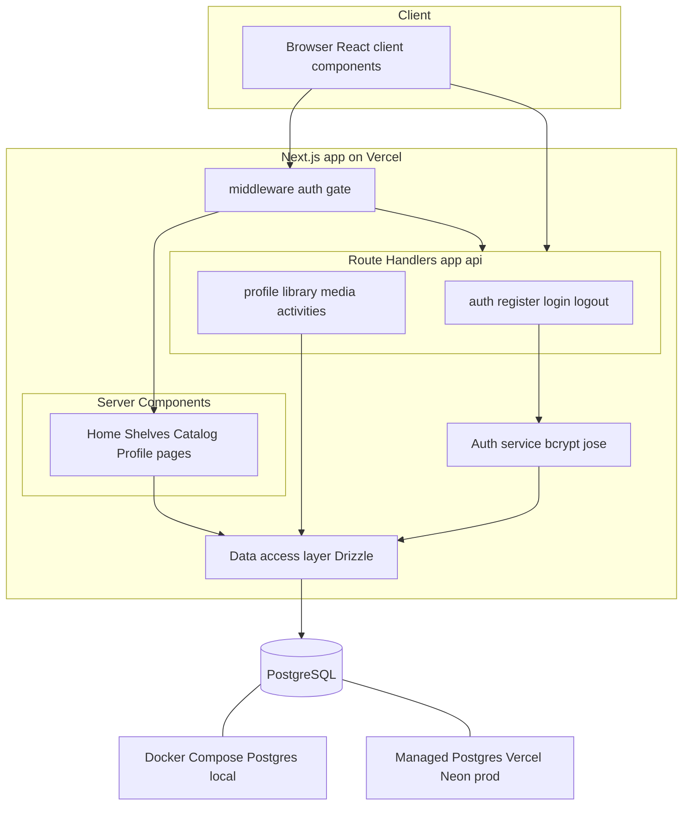
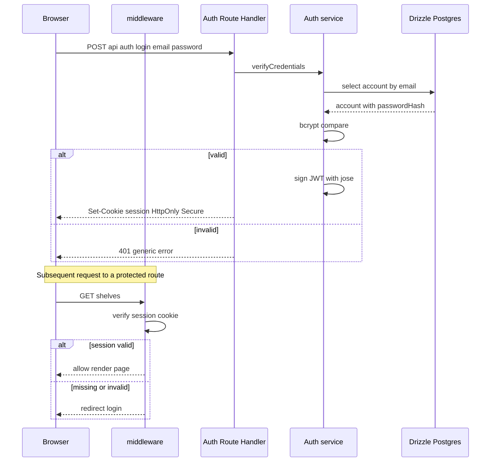
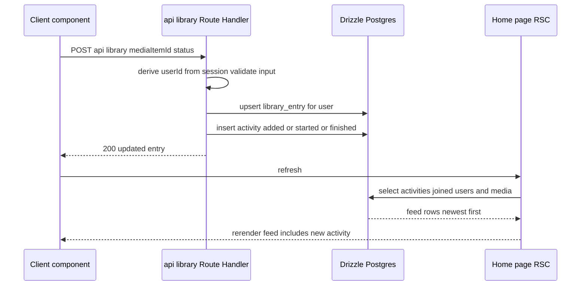
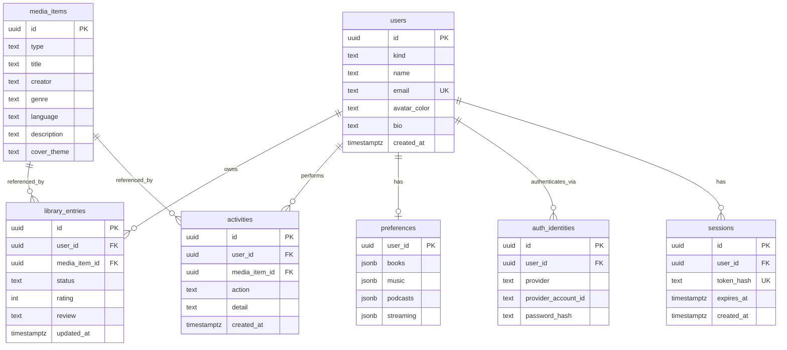

# Technical Design: Full-Stack Re-Platform + Home Page & Routed Pages

## Overview

**Purpose**: Re-platform LibraryLoop from a client-only vanilla-JS prototype into a full-stack, typed web application, and on that foundation deliver a routed multi-page experience (Home with hero + stats + filterable Feed, plus dedicated Shelves, Catalog, and Profile pages).

**Users**: Signed-in readers navigate focused pages via real URLs; their data is durably stored server-side behind real authentication; the Home Feed surfaces community activity with a future-proof media-type filter.

**Impact**: Replaces the single `app.js` IIFE and `localStorage` with **Next.js (App Router) + React + TypeScript**, **PostgreSQL via Drizzle ORM**, **Next.js Route Handlers** as the backend API, **real auth** (bcrypt + signed httpOnly session cookie), **Docker** for local Postgres, and **Vercel + managed Postgres** for production. The prototype is preserved as the behavioral/data-model/visual reference. The previously planned hand-rolled History-API router and `vercel.json` SPA rewrite are obsolete (Next.js provides routing natively).

### Goals
- Typed full-stack app: shared domain + API types, strict TS, build fails on type errors.
- Routes Home/Shelves/Catalog/Profile via App Router; auth-gated; deep-link + back/forward native.
- Home page: hero (image fallback), mock stats panel (Goals-ready), filterable community Feed (data-derived media-type filter).
- Postgres schema + versioned migrations + seed reproducing prototype data; all access via typed backend.
- Real auth (hashed passwords, signed session cookie, per-user authorization).
- Docker Compose local Postgres; Vercel + managed Postgres production with migrations applied on deploy.

### Non-Goals
- Recommendations page + NYT integration (owned by `nyt-recommendations`, to be realigned to this stack).
- Live stats/Goals aggregation (mock this slice; 3.8).
- A polished final visual design (CSS is ported as-is; full re-skin is a later effort).
- New media types' full workflows (only the model must accommodate them; 6.x).
- **Google SSO sign-in** — deferred to a later release; this design only pre-provisions the data model (`auth_identities`) so it can be added without schema change.

## Architecture

### Existing Architecture Analysis
- Prototype: one IIFE, `state`→`render()`→`innerHTML`, delegated events, `localStorage` key `libraryloop.ebooks.v2`, plaintext passwords. Entities: `accounts`, `communityUsers`, `mediaItems` (`type`/title/creator/genre/language/coverTheme/description), `libraryEntries` (status/rating/review/updatedAt), `activities` (action/detail/createdAt), nested `preferences`.
- Reused as reference: domain model, flows (register/login, shelves, reviews, custom book, feed), and `styles.css` visual tokens. Recommendation scoring is intentionally dropped here.

### Architecture Pattern & Boundary Map

Selected pattern: **Next.js full-stack (App Router) on Vercel** — React Server Components fetch data through a typed data-access layer; client components perform mutations via Route Handlers; Drizzle/Postgres is the system of record; auth is enforced in middleware and per handler.



**Architecture Integration**:
- **Selected pattern**: Next.js full-stack — one project hosts UI, API, and data layer; canonical Vercel shape.
- **Domain boundaries**: `Routing/Pages` (RSC composition), `UI components` (presentation + client interactivity), `API` (Route Handlers, contract enforcement), `Auth service` (hashing/sessions/authorization), `Data access layer` (Drizzle queries/types), `Schema/Migrations/Seed` (Postgres), `Infra` (Docker, Vercel, env). Boundaries are file/module-separated to allow parallel implementation.
- **New components rationale**: framework + backend + DB + auth are all newly required by the re-platform; the hand-rolled router and `localStorage` are removed.
- **Steering compliance**: no steering files exist; design follows the resolved stack decisions recorded in `research.md`.

### Technology Stack

| Layer | Choice / Version | Role in Feature | Notes |
|-------|------------------|-----------------|-------|
| Frontend | Next.js 15 (App Router), React 19, TypeScript (strict) | Pages, navigation, components, RSC data fetch | Replaces IIFE; file-based routing (Req 2) |
| Backend | Next.js Route Handlers (`app/api/**`) | Typed JSON API for auth + data | Same project/deploy (Req 8) |
| Auth | bcrypt (hashing) + DB-backed sessions (opaque token, HttpOnly cookie) | Registration, login, revocable session, authorization | `auth_identities` table is SSO-ready for the future Google release; Auth.js considered, rejected (research.md) |
| Data / ORM | Drizzle ORM + drizzle-kit | Typed schema, queries, versioned migrations | Types inferred from schema (Req 6, 10) |
| Data / Storage | PostgreSQL 16 | System of record | Docker local; managed prod |
| Infrastructure | Docker Compose (local), Vercel + managed Postgres (prod) | Consistent local env; production hosting | Migrations applied on deploy (Req 11, 12) |

Deviations from prototype: introduces a build step, a backend, a relational DB, and Docker; removes `localStorage`, plaintext passwords, the custom router, and the `vercel.json` SPA rewrite.

## System Flows

### Authentication & route gating



Key decisions: `userId` is taken only from the verified session, never from request bodies (9.7, 8.4). Sign-out clears the cookie (9.5).

### Add-to-shelf → activity → Home Feed



## Requirements Traceability

| Requirement | Summary | Components | Interfaces | Flows |
|-------------|---------|------------|------------|-------|
| 1.1–1.6 | TS + Next.js + React; typed domain; build fails on type errors; componentized | Project setup, Domain Types, all components | tsconfig, shared types | — |
| 2.1–2.8 | Routes; persistent nav; client nav; active link; back/forward; deep-link; not-found; auth gate | App Router pages, Nav, middleware | route files, `middleware.ts` | Auth gating |
| 3.1–3.9 | Home default; hero + fallback + greeting + CTA; mock stats panel | HomePage, Hero, StatsPanel | `getHomeData`, `HomeStats` | — |
| 4.1–4.7 | Feed below hero/stats; entries/order/live/omit/empty; filter persistence | FeedView, FeedFilter | `getFeed`, `FeedEntryDTO` | Add-to-shelf feed |
| 5.1–5.4 | Data-derived media-type filter; non-ebook works; label fallback | FeedFilter, MediaType util | `deriveMediaTypeOptions`, `mediaTypeLabel` | — |
| 6.1–6.4 | Media type as first-class field; extensible; label fallback; seed ebook | DB schema, MediaType util, Seed | `media_items.type` | — |
| 7.1–7.5 | Standalone Shelves/Catalog/Profile; actions persist to feed; non-Home hides home regions | Pages, Route Handlers | `/api/library`, `/api/media`, `/api/profile` | Add-to-shelf feed |
| 8.1–8.5 | Typed API endpoints; browser→API only; validation + status codes; authorization; shared types | API layer, DAL, Domain Types | Route Handler contracts | Both flows |
| 9.1–9.8 | Register/login; bcrypt; revocable DB session; protect routes; true sign-out; dup email; per-user authz; SSO-ready credential separation | Auth service, Auth API, middleware, auth_identities/sessions | `AuthService` | Auth gating |
| 10.1–10.6 | Unified users + identities + sessions + media/entries/activities/preferences; migrations; FK integrity + nullable-unique email; status/rating/review; seed; typed query layer | DB schema, Migrations, Seed, DAL | Drizzle schema | — |
| 11.1–11.5 | Docker Compose Postgres; env connect; volume; documented commands; parity; no prod secrets | Infra (Docker) | `docker-compose.yml` | — |
| 12.1–12.6 | Env-based config; `.env.example`; Vercel + managed PG; migrations on deploy; fail-fast; README | Infra, Config | env schema | — |
| 13.1–13.5 | Responsive; ported visual language; a11y labels; locale time; semantic controls | All UI components | — | — |

## Components and Interfaces

> The TypeScript blocks are concrete contract specifications (this is now a TypeScript codebase). `any` is disallowed (1.4).

| Component | Domain/Layer | Intent | Req Coverage | Key Dependencies (P0/P1) | Contracts |
|-----------|--------------|--------|--------------|--------------------------|-----------|
| App Router + middleware | Routing | Define routes; gate auth; not-found | 2, 9 | Auth service (P0) | Service |
| Persistent Nav | UI | Cross-page nav, active link, extensible | 2, 13 | App Router (P0) | — |
| HomePage / Hero / StatsPanel | UI | Default page: hero + mock stats + feed | 3 | FeedView (P0) | — |
| FeedView / FeedFilter | UI+Logic | Render + filter community activity | 4, 5, 13 | DAL/API (P0), MediaType util (P0) | Service |
| Shelves / Catalog / Profile pages | UI | Standalone pages preserving behavior | 7 | Data API (P0) | — |
| Auth service | Backend | Hash, verify, session sign/verify, authz | 9, 8 | DAL (P0), bcrypt/jose (P0) | Service |
| Data API (Route Handlers) | Backend | Typed JSON endpoints for UI ops | 8, 7, 4 | DAL (P0), Auth service (P0) | API |
| Data access layer | Data | Drizzle queries + inferred types | 8, 10 | Postgres (P0) | Service |
| DB schema / Migrations / Seed | Data | Tables, integrity, versioned evolution, starter data | 10, 6 | Postgres (P0) | State |
| Infra: Docker + Vercel + Config | Infra | Local Postgres; prod deploy; env/secrets | 11, 12 | Vercel/Docker (P0) | — |

### Domain & Shared Types

```typescript
export type MediaType = "ebook" | string; // open set; UI never assumes only "ebook" (6.1)
export type LibraryStatus = "wishlist" | "current" | "finished";
export type UserKind = "member" | "community"; // member = can authenticate; community = feed-only seed actor
export type AuthProvider = "password" | "google"; // "google" reserved for the future SSO release

// Unified actor: both real members and seed "community" users live here, so activities/library
// entries reference a single table with valid FKs (fixes polymorphic-actor integrity).
export interface User {
  id: string; kind: UserKind; name: string;
  email: string | null;        // null allowed for community-only seed actors
  avatarColor: string; bio: string;
}
// Credentials are separated from User so a Google identity can be added later with no schema change.
export interface AuthIdentity {
  id: string; userId: string; provider: AuthProvider;
  providerAccountId: string | null; // null for password; Google "sub" later
  passwordHash: string | null;      // set only for provider="password"
}
// Server-validated, revocable session (enables true sign-out; no stateless-JWT gap).
export interface Session { id: string; userId: string; expiresAt: string; }
export interface MediaItem {
  id: string; type: MediaType; title: string; creator: string;
  genre: string; language: string; description: string; coverTheme: string;
}
export interface LibraryEntry {
  id: string; userId: string; mediaItemId: string;
  status: LibraryStatus; rating: number | null; review: string; updatedAt: string;
}
export interface Activity {
  id: string; userId: string; mediaItemId: string;
  action: "added" | "started" | "finished" | "reviewed"; detail: string; createdAt: string;
}
export interface Preferences {
  books: { favoriteAuthors: string[]; favoriteGenres: string[]; languages: string[] };
  music: { favoriteArtists: string[]; favoriteGenres: string[] };
  podcasts: { topics: string[] };
  streaming: { favoriteGenres: string[] };
}
```
DTOs (API payloads) are derived from these and shared by client and server (8.5).

### Routing

#### App Router + middleware
Summary block (Service contract).
- **Routes**: `app/(app)/page.tsx` (Home, `/`), `app/(app)/shelves/page.tsx`, `app/(app)/catalog/page.tsx`, `app/(app)/profile/page.tsx`; `app/(auth)/login` + `/register`; `app/not-found.tsx` (2.7). The `(app)` group renders the persistent Nav + page; `(auth)` renders the auth surface.
- **Gating**: `middleware.ts` verifies the session cookie; unauthenticated requests to `(app)` routes redirect to `/login` (2.8, 9.4). Route Handlers re-check the session server-side (defense in depth).
- **Nav**: a client component using `usePathname()` to mark the active link via `aria-current` (2.4, 13.3); links are real `<Link>`/`<a>` (13.5); structured so `/recommendations` can be appended (2.2).
- Implementation Note: client nav + deep-link + back/forward are provided by Next; no custom router code (supersedes prior design).

### UI

#### HomePage / Hero / StatsPanel — summary-only (3.x)
- **Hero**: CSS `background-image` over a gradient/solid base so a missing/failed image degrades to the backdrop with no broken-image element (3.4); headline + greeting with the session user's name (3.5); optional CTA `<Link>` to Catalog/Shelves (3.6).
- **StatsPanel**: renders a typed `HomeStats` with mock values and a reserved Goals block (3.7, 3.8): `interface HomeStats { wishlist: number; current: number; finished: number; reviewed: number; goals?: GoalsPlaceholder }`.
- **HomePage**: Server Component composing Hero + StatsPanel + FeedView; only this route renders these regions (7.5).

#### FeedView / FeedFilter

| Field | Detail |
|-------|--------|
| Intent | Render newest-first community activity and filter by media type |
| Requirements | 4.1–4.7, 5.1–5.4, 13.3, 13.4 |

**Responsibilities & Constraints**
- Server-fetch feed rows (join activities→users→media), omit unresolved (4.6), render actor/avatar/detail/title + locale time (4.3, 13.4).
- Derive filter options from distinct media types present (5.2) + an `all` option; apply filter; empty state when none (4.7).
- Persist the active filter for the session via a URL query param (`?type=`) so refresh/share preserves it (4.7).

**Contracts**: Service [x]
```typescript
interface FeedEntryDTO {
  id: string; actorName: string; avatarColor: string;
  detail: string; itemTitle: string; mediaType: MediaType; createdAt: string;
}
interface FeedQuery { type?: MediaType | "all" }
function deriveMediaTypeOptions(items: MediaItem[]): { value: string; label: string }[];
function mediaTypeLabel(type: string): string; // MEDIA_TYPE_LABELS[type] ?? humanize(type) (5.3)
```
- Postconditions: rendered entries all match the active filter; default `all` (5.6).
- Invariant: an activity with unresolvable user/item is never rendered.

#### Shelves / Catalog / Profile pages — summary-only (7.x)
Server Components fetch the user's entries/catalog/profile via the DAL and render React ports of the existing sections. Interactive controls (status buttons, genre filter, custom-book form, star rating, review textarea, profile form) are client components posting to Route Handlers, then refreshing. Behavior parity with the prototype is required (7.1–7.3).

### Backend

#### Auth service

| Field | Detail |
|-------|--------|
| Intent | Registration, login, session issuance/verification, authorization helper |
| Requirements | 9.1–9.7, 8.4 |

**Contracts**: Service [x]
```typescript
interface AuthService {
  register(input: { name: string; email: string; password: string }):
    Promise<{ ok: true; user: User } | { ok: false; error: "email_taken" | "invalid" }>;
  // Creates a member user + a provider="password" auth_identity.
  login(input: { email: string; password: string }):
    Promise<{ ok: true; sessionToken: string } | { ok: false }>; // raw token set as HttpOnly cookie
  createSession(userId: string): Promise<string>;     // inserts sessions row; returns raw opaque token
  verifySession(token: string | undefined): Promise<User | null>; // hash -> lookup -> expiry check
  revokeSession(token: string): Promise<void>;        // deletes the sessions row (true sign-out, 9.5)
  hashPassword(plain: string): Promise<string>;       // bcrypt cost >= 12
}
```
- Preconditions: email normalized/lowercased; password non-empty.
- Postconditions: passwords stored only as bcrypt hashes inside `auth_identities` (9.1); the session is a server-validated `sessions` row keyed by a hashed opaque token delivered in an `HttpOnly; Secure; SameSite=Lax` cookie (9.3); duplicate email rejected (9.6); sign-out deletes the row so the token no longer authenticates (9.5).
- Invariants: `userId` for any authorized operation comes only from `verifySession`, never request input (9.7, 8.4); credential lookups go through `auth_identities` so a future `provider="google"` path reuses the same session machinery.

**Implementation Notes**
- Integration: store only the SHA-256 hash of the session token; raw token lives solely in the cookie. Generic 401 messages (no user enumeration on login). `AUTH_SECRET` is used for cookie integrity/CSRF defenses, not for stateful identity.
- Migration path: Google SSO (future release) adds a `provider="google"` identity + a callback route; `users`, `sessions`, and all data handlers are unaffected.
- Risks: enforce ownership checks in every data handler.

#### Data API (Route Handlers)

**Contracts**: API [x]

| Method | Endpoint | Request | Response | Errors |
|--------|----------|---------|----------|--------|
| POST | /api/auth/register | { name, email, password } | { user } + Set-Cookie | 400, 409 |
| POST | /api/auth/login | { email, password } | { user } + Set-Cookie | 400, 401 |
| POST | /api/auth/logout | — | { ok } + clear cookie | 401 |
| GET | /api/profile | — | { user, preferences } | 401 |
| PUT | /api/profile | { name, email, bio, preferences } | { user, preferences } | 400, 401, 409 |
| GET | /api/media | ?type= | { items: MediaItem[] } | 401 |
| POST | /api/media | { title, creator, genre, language, description, status } | { item, entry } | 400, 401 |
| GET | /api/library | — | { entries: LibraryEntry[] } | 401 |
| POST | /api/library | { mediaItemId, status } | { entry } | 400, 401 |
| POST | /api/library/review | { entryId, rating, review } | { entry } | 400, 401, 403 |
| GET | /api/activities | ?type= | { entries: FeedEntryDTO[] } | 401 |

- All handlers: validate inputs, derive `userId` from session, return typed JSON + status codes (8.1–8.4). 403 when a record is not owned by the user (9.7).

### Data

#### DB schema / Migrations / Seed (Drizzle + Postgres)

**Contracts**: State [x]


- **Unified actor (fixes Issue 1)**: members and seed community users share one `users` table distinguished by `kind` (`member` | `community`). `library_entries.user_id` and `activities.user_id` are real FKs to `users`, so community feed activity resolves through a normal join with full referential integrity (10.3, 4.2). `email` is unique but nullable (community actors need none); Postgres permits multiple NULLs under a UNIQUE constraint.
- **Separated credentials (SSO-ready)**: `auth_identities` holds one row per login method per user — `provider="password"` with a bcrypt `password_hash`, or, in the **future Google SSO release**, `provider="google"` with the Google `sub` as `provider_account_id` and a NULL `password_hash`. Unique on `(provider, provider_account_id)`. Community users have zero identities and cannot sign in. Adding Google later requires **no change to `users`** — only new identity rows.
- **Revocable sessions (fixes Issue 2)**: `sessions` stores a per-login record; the HTTP-only cookie carries an opaque random token whose SHA-256 hash is stored in `token_hash` (the raw token is never persisted). Middleware/handlers resolve the session by token hash and reject if missing/expired; **sign-out deletes the session row**, so the prior session is genuinely unusable afterward (9.5). This also enables future "log out everywhere".
- **Constraints**: `status ∈ {wishlist,current,finished}`; `rating` nullable 1–5 (CHECK); `review` nullable text (10.4); `kind`/`provider`/`action` value-constrained.
- **Preferences**: 1:1 with `users` via `user_id` PK/FK; nested per-media-type blobs stored as `jsonb` typed to the `Preferences` interface.
- **Migrations**: `drizzle-kit` generates SQL migrations under `db/migrations`, checked in and applied locally and on deploy (10.2, 12.4).
- **Seed**: a script inserts the prototype's starter catalog, the seed community users (`kind="community"`, no identities), and the demo member (`kind="member"` + a `password` identity with a bcrypt hash) so the app is demonstrable post-setup (10.5); existing books seeded as `type="ebook"` (6.4).
- **Typed query layer**: Drizzle schema in `db/schema.ts`; row types via `InferSelectModel`; no string-concatenated SQL (10.6).
- **Driver selection**: serverless/HTTP driver in production (Vercel/Neon), `node-postgres` pool locally — chosen by env to avoid serverless connection exhaustion.

### Infrastructure

#### Docker / Vercel / Config — summary-only (11.x, 12.x)
- **Docker**: `docker-compose.yml` with `postgres:16`, a named volume for persistence (11.2), env-provided local credentials (11.5); optional `app` service for `next dev` (11.4). README documents `docker compose up`, migrate, seed (11.3).
- **Vercel**: Next.js project; production `DATABASE_URL` (managed Postgres) + `AUTH_SECRET` set as Vercel env vars (12.3); migrations applied via a deploy/build step (12.4). The prior `vercel.json` SPA rewrite is removed (Next routing supersedes it).
- **Config**: a typed env loader validates required vars at startup and fails fast (12.5); `.env.example` lists `DATABASE_URL`, `AUTH_SECRET` (and `NYT_API_KEY` for the recommendations spec) without real values; `.env*` gitignored (12.1, 12.2).

## Data Models

### Domain Model
Aggregates: **User** (a `member` owns its auth identities, sessions, library entries, activities, preferences; a `community` user is a feed-only actor with none of the former) and **MediaItem** (catalog, shared). Invariants: unique non-null email; `status ∈ {wishlist,current,finished}`; `rating ∈ {1..5} | null`; a finished-only review/rating (clearing rating/review when status leaves `finished`, mirroring prototype behavior). Media `type` is an open string set so new types need no schema change (6.1, 6.2). Credentials live in `auth_identities` (one per provider) so adding Google SSO later does not alter the `User` aggregate.

### Data Contracts & Integration
- API DTOs are TypeScript types shared between Route Handlers and client components (8.5); JSON over HTTP; validation at every handler boundary.
- No cross-service distributed transactions; single Postgres database with FK integrity.

## Error Handling

### Error Strategy
Fail fast on config; validate at API boundaries; degrade UI gracefully.

### Error Categories and Responses
- **Auth** (401/403): unauthenticated → redirect to `/login` (routes) or 401 (API); not-owner → 403 (9.7).
- **Validation** (400): invalid/missing fields → typed field errors.
- **Conflict** (409): duplicate email on register/profile update (9.6).
- **Not found** (404): unknown route → `not-found.tsx` (2.7).
- **Config** (startup): missing `DATABASE_URL`/`AUTH_SECRET` → fail fast with clear message (12.5).
- **Data gaps** (UI): unresolved activity omitted (4.6); empty feed → empty state (4.7); failed hero image → CSS backdrop (3.4).

### Monitoring
Server-side logging of handler errors (no secrets in logs); rely on Vercel's runtime logs in production.

## Testing Strategy

### Unit Tests
- `mediaTypeLabel`: maps `ebook→Books`; humanizes unknown type (5.3).
- `deriveMediaTypeOptions`: `[All, Books]` for ebook-only; adds new type when present (5.2).
- `AuthService.hashPassword`/login: bcrypt hash never plaintext; correct/incorrect password verification (9.1, 9.2).
- `verifySession`: rejects tampered/expired tokens (9.3).
- Feed selection: desc order, omit unresolved, filter by type, empty path (4.4, 4.6, 4.7).

### Integration Tests
- Register → duplicate email rejected (9.6); login sets cookie; protected endpoint 401 without session (9.4).
- Add-to-shelf via `/api/library` creates entry + activity owned by session user (7.4, 8.4).
- Profile update authorization: cannot modify another user's record (9.7).
- Migration + seed against a Docker Postgres yields the demo account + starter catalog (10.5).

### E2E / Deployment Tests
- Deep-load and refresh `/shelves`, `/catalog`, `/profile`, `/` while authenticated → correct page, no 404 (2.6); unauthenticated → redirect to login (2.8).
- Back/forward navigates between pages (2.5).
- On Vercel preview with managed Postgres: sign-in, add a book, see it in the Home Feed (4.5).

## Security Considerations
- Passwords: bcrypt (cost ≥ 12) stored in `auth_identities`, never stored or logged in plaintext (9.1).
- Sessions: server-validated `sessions` row; cookie carries an opaque random token, only its SHA-256 hash is stored; `HttpOnly; Secure; SameSite=Lax`; sign-out deletes the row for true revocation (9.3, 9.5). `AUTH_SECRET` (env only) backs cookie integrity/CSRF defenses (12.1).
- Authorization: `userId` always from verified session; ownership enforced per handler (8.4, 9.7).
- SSO-readiness: the future Google provider authenticates via a new `auth_identities` row and reuses the same `sessions` mechanism — no broadening of trust in the data handlers.
- Secrets: `.env*` gitignored; `.env.example` only; fail-fast on missing config (12.2, 12.5).
- Output: continue escaping/encoding user-supplied content (React escapes by default); avoid `dangerouslySetInnerHTML`.
- DB: parameterized queries via Drizzle only (no string SQL) (10.6).

## Performance & Scalability
- Use the serverless/HTTP Postgres driver in production to avoid connection exhaustion under Vercel concurrency; small local pool.
- RSC server-fetch for first paint; feed capped (e.g., 12 like the prototype) and indexed by `created_at` for ordering.
- Prototype-scale data; no caching layer required this slice (NYT caching is owned by the recommendations spec).

## Open Questions / Risks
- **`nyt-recommendations` realignment**: that spec currently assumes vanilla JS + a standalone `/api` function + `vercel.json` rewrite. It must be updated to a Next.js `/recommendations` route + `/api/recommendations` Route Handler reading `NYT_API_KEY`. Tracked as follow-up (out of scope here).
- **Migrations on Vercel**: confirm whether migrations run in the build step or a separate deploy hook (12.4) during task planning.
- **Auth library**: custom DB-backed session selected over Auth.js. The `auth_identities` design intentionally anticipates the **Google SSO release**; if multiple OAuth providers or account-linking grow complex, revisit adopting Auth.js with a Drizzle adapter at that time.
