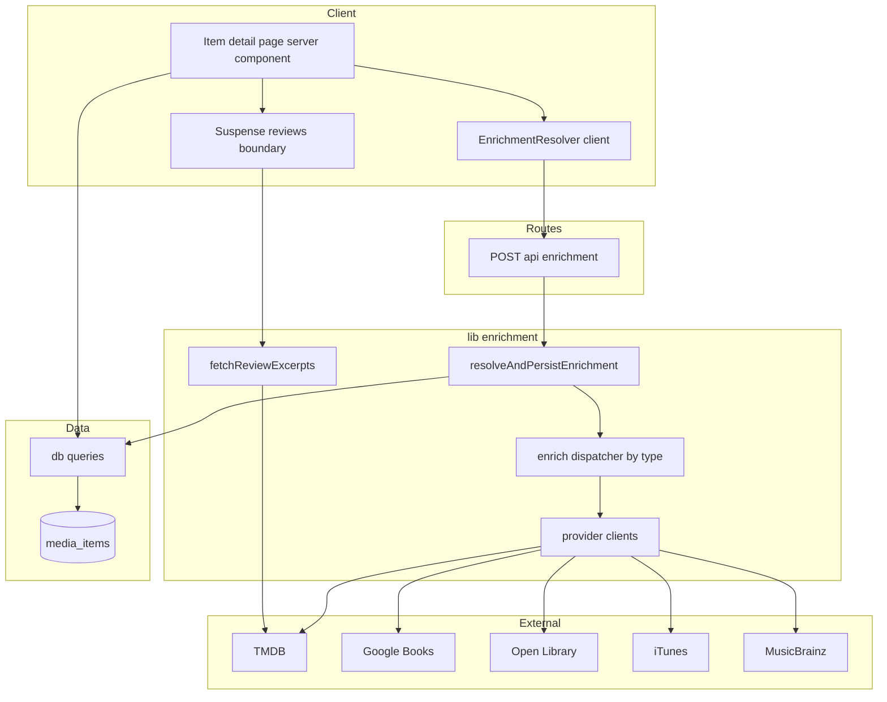
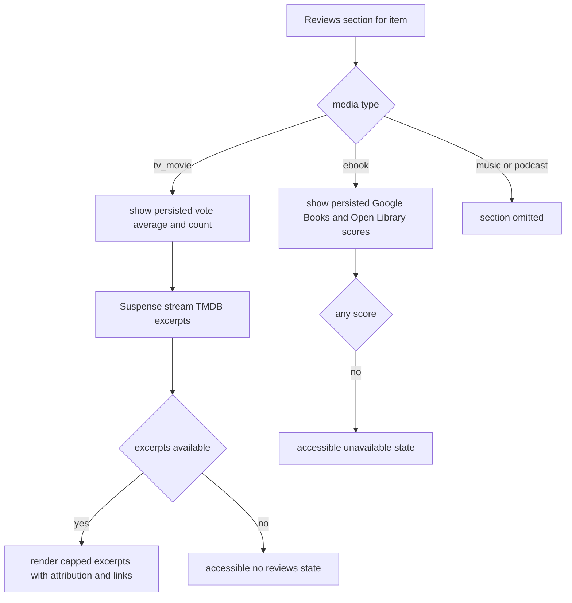

# Design Document

## Overview

**Purpose**: Enrich the existing media item detail page (`/item/[id]`) with type-appropriate metadata and a reviews/ratings section, sourced from external providers and degrading gracefully per media type.

**Users**: Signed-in readers viewing an item gain richer context (runtime/cast, pages/publisher, tracks/label, episode counts) and — where a free source exists — ratings and review excerpts, without leaving the app.

**Impact**: Adds two persisted columns to `media_items` (`enrichment`, `enrichment_checked_at`) and two new read surfaces *within* the existing detail page. It is strictly additive: the page's current content, shelf/review/tag actions, route gating, and cross-surface links are unchanged. Enrichment reuses the cover-art **resolve-and-cache** pattern; transient review excerpts stream via Suspense. Nothing blocks the initial render, and every external dependency fails soft.

### Goals
- Show per-type enriched metadata for movies/TV, books, music, and podcasts, omitting absent fields cleanly.
- Show a reviews/ratings section with per-type coverage: movies/TV = score + excerpts, books = scores only, music/podcasts = omitted.
- Resolve enrichment once per item and cache it; never block render or repeat the lookup.
- Keep all external calls server-side, isolated, timed-out, and safe (no `any`, no `dangerouslySetInnerHTML`).

### Non-Goals
- No OMDb / Last.fm / Podcast Index / Goodreads integration (no new keys beyond Google Books).
- No reviews/scores for music or podcasts (no free source exists).
- No changes to the trending-resolve contract or the `media_items` de-dup key; no external-id column.
- No persistence of third-party review excerpt text (fetched per view).

## Architecture

### Existing Architecture Analysis
- **Pattern to reuse**: cover-art resolve-and-cache — `media_items.artworkUrl` + `artworkCheckedAt`; client `CoverResolver` fires once → `POST /api/cover` → idempotent `resolveAndPersistCover` (skips when `artworkUrl || artworkCheckedAt`); render does no writes; `resolveCover` dispatches per type to keyless clients built on `covers/http.ts`.
- **Boundaries preserved**: auth via `getSessionUser`; Route Handlers return the shared `ApiError` envelope; server components read persisted data; client components mutate; `MediaItemMetadata` is a per-`kind` discriminated union validated at the boundary (never `any`).
- **Constraint**: `media_items` has no external id; providers are re-queried by `type`/`title`/`creator`.

### Architecture Pattern & Boundary Map



**Architecture Integration**
- **Selected pattern**: Resolve-and-cache (client trigger → idempotent persist) for enrichment metadata + scores; Suspense-streamed read-only server fetch for transient review excerpts.
- **Feature boundaries**: A new `lib/enrichment/` domain (providers, dispatcher, service, reviews) parallel to `lib/covers/`; presentation in new components under `components/item/`; one new Route Handler; data access via new query helpers. No cross-talk with search/trending code beyond shared `covers/http.ts`.
- **Existing patterns preserved**: per-type dispatch, validation-at-boundary, `ApiError` envelope, server-read/client-mutate, no writes in render.
- **New components rationale**: enrichment must persist (needs a write route + client trigger); excerpts are transient (need a streamed read); display needs new presentational sections.
- **Steering compliance**: additive/non-breaking; reuse over new mechanisms; keyless helper + existing key + one new env var; tests for new pure logic and DAL/route.

### Technology Stack

| Layer | Choice / Version | Role in Feature | Notes |
|-------|------------------|-----------------|-------|
| Frontend | Next.js 15 App Router, React 19 | Server detail page + Suspense reviews; client `EnrichmentResolver` | Reuses design system; no new UI deps |
| Backend / Services | Next.js Route Handler (`nodejs` runtime) | `POST /api/enrichment` idempotent persist | Mirrors `/api/cover` |
| External | TMDB (keyed), Google Books (keyed), Open Library / iTunes / MusicBrainz (keyless) | Metadata + scores + TMDB excerpts | Via `covers/http.ts` `fetchJson` + timeout |
| Data / Storage | PostgreSQL + Drizzle ORM | `enrichment` jsonb + `enrichment_checked_at` on `media_items` | Additive migration via `drizzle-kit generate` |
| Config | env (`GOOGLE_BOOKS_API_KEY` new; `TMDB_API_KEY` existing) | Provider credentials | gitignored `.env`; empty placeholder in `.env.example` |

## System Flows

### Enrichment resolve-and-cache (first view vs. cached)

```mermaid
sequenceDiagram
  participant U as Browser
  participant P as Detail page server
  participant R as EnrichmentResolver client
  participant A as POST api enrichment
  participant S as resolveAndPersistEnrichment
  participant X as Providers external
  participant D as media_items

  U->>P: GET item id
  P->>D: read item (incl enrichment)
  P-->>U: render core + enriched (if present) + resolver (if not checked)
  alt enrichment_checked_at is null
    R->>A: POST mediaItemId
    A->>S: resolve+persist (idempotent)
    S->>D: re-read; skip if already checked
    S->>X: per-type lookups (isolated, timed-out)
    X-->>S: partial fields or unavailable
    S->>D: write enrichment + checked_at
    A-->>R: ok
    R->>U: router.refresh()
  else already checked
    Note over R: resolver not rendered; no external call
  end
```

Key decisions: idempotency keyed on `enrichment_checked_at` (a definitive "no data" still stamps the time so it never refetches); the resolver renders only when `enrichment_checked_at` is null; a provider failure yields a partial result, never an exception.

### Reviews section (per-type)



## Requirements Traceability

| Requirement | Summary | Components | Interfaces | Flows |
|-------------|---------|------------|------------|-------|
| 1.1–1.7 | Per-type enriched metadata display | `EnrichmentDetails` | `MediaEnrichment` union; `selectEnrichmentFields` | Reviews/metadata render |
| 2.1–2.6 | Non-blocking fetch + cache + additive persist + boundary validation | `EnrichmentResolver`, `resolveAndPersistEnrichment`, queries, migration | `POST /api/enrichment`; `updateMediaEnrichment` | Resolve-and-cache |
| 3.1–3.5 | Server-side, isolated, timed-out, agreed providers, bounded | provider clients, `enrich` dispatcher | `EnrichmentProvider`; `covers/http.ts` | Resolve-and-cache |
| 4.1–4.6 | Reviews section with per-type coverage | `ReviewsSection`, `ReviewExcerpts` | `fetchReviewExcerpts`; `ReviewScore`, `ReviewExcerpt` | Reviews section |
| 5.1–5.4 | Safe external text + links + attribution | `ReviewExcerpts` | plain-text render; `httpsOrNull`; rel attrs | Reviews section |
| 6.1–6.4 | Config & secrets; graceful when key absent | `enrichmentConfig`, providers | env read; `isConfigured` | Resolve-and-cache |
| 7.1–7.4 | Loading / empty / error states; no regressions | `loading`, Suspense fallback, resolver | graceful outcomes | Both flows |
| 8.1–8.4 | A11y + responsive + theme | `EnrichmentDetails`, `ReviewsSection` | design tokens; roles/labels | — |
| 9.1–9.4 | Additive, reuse, quality, no `any` | all | typed contracts | — |

## Components and Interfaces

| Component | Domain/Layer | Intent | Req Coverage | Key Dependencies (P0/P1) | Contracts |
|-----------|--------------|--------|--------------|--------------------------|-----------|
| `EnrichmentProvider` clients (tmdb, googlebooks, openlibrary, itunes, musicbrainz) | lib/enrichment | Fetch + normalize one source into partial enrichment | 1, 3, 6 | `covers/http.ts` (P0) | Service |
| `enrich` dispatcher | lib/enrichment | Route an item by type to its providers; merge partials | 1, 3 | provider clients (P0) | Service |
| `resolveAndPersistEnrichment` | lib/enrichment | Idempotent resolve + persist (cover-style) | 2, 3, 7 | dispatcher, queries (P0) | Service |
| `fetchReviewExcerpts` | lib/enrichment | Read-only transient TMDB excerpt fetch | 4, 5 | `covers/http.ts` (P0) | Service |
| `POST /api/enrichment` | app/api | Auth + delegate to service | 2, 7 | service (P0) | API |
| `updateMediaEnrichment`, read changes in `findMediaById` | db | Persist/read enrichment columns | 2 | Drizzle (P0) | State |
| `EnrichmentResolver` | components/item (client) | Fire-once trigger + refresh | 2, 7 | `POST /api/enrichment` (P0) | State |
| `EnrichmentDetails` | components/item | Render per-type enriched fields | 1, 8 | `MediaEnrichment` (P1) | — |
| `ReviewsSection` + `ReviewExcerpts` | components/item | Scores + streamed excerpts, per-type | 4, 5, 8 | `fetchReviewExcerpts` (P0) | — |

### lib/enrichment

#### EnrichmentProvider clients & dispatcher

| Field | Detail |
|-------|--------|
| Intent | Re-query each external source by type/title/creator, normalize into a typed partial enrichment, and merge |
| Requirements | 1.2, 1.3, 1.4, 1.5, 3.1, 3.2, 3.3, 3.4, 3.5, 6.3 |

**Responsibilities & Constraints**
- Each provider performs at most a bounded set of requests with a per-request timeout; maps any failure (unconfigured/timeout/error/no data) to an empty partial — never throws (3.2).
- Field caps: cast ≤ a small N, categories/subjects ≤ N (3.5).
- MusicBrainz sends a descriptive `User-Agent` and makes a single capped request (rate-limit aware).
- The dispatcher merges per-source partials into one `MediaEnrichment` for the item's `kind`; sources are independent so one empty partial doesn't suppress another (3.3).

**Dependencies**
- External: TMDB, Google Books, Open Library, iTunes, MusicBrainz — metadata/scores (P0).
- Outbound: `covers/http.ts` `fetchJson`/`httpsOrNull`/`isRecord` (P0).

**Contracts**: Service [x]

##### Service Interface
```typescript
export interface EnrichmentFetchDeps {
  fetchImpl?: typeof fetch;
  timeoutMs?: number;
  env?: Record<string, string | undefined>; // same source used by isConfigured
}

// One source's contribution; returns a partial for the item's kind (never throws).
export interface EnrichmentProvider {
  readonly id: string;
  readonly mediaTypes: readonly string[];          // e.g. ["tv_movie"], ["ebook"]
  isConfigured(env: Record<string, string | undefined>): boolean;
  enrich(
    item: Pick<MediaItem, "type" | "title" | "creator">,
    deps: EnrichmentFetchDeps,
  ): Promise<Partial<MediaEnrichment>>;
}

// Dispatch by media type, merging configured providers' partials.
export function enrichItem(
  item: Pick<MediaItem, "type" | "title" | "creator">,
  deps?: EnrichmentFetchDeps,
): Promise<MediaEnrichment | null>;
```
- Preconditions: `item.type` is a known media type; otherwise returns `null`.
- Postconditions: returns a `MediaEnrichment` whose `kind` matches the item type, or `null` when no source produced data.
- Invariants: no provider throws; total external requests per item are bounded.

**Implementation Notes**
- Integration: per-type provider table mirrors `ITUNES_ENTITIES`/`resolveCover`.
- Validation: every response parsed via `isRecord` guards into the typed union; numbers coerced/clamped; URLs via `httpsOrNull`.
- Risks: search mismatch → reuse cover-style matching; MusicBrainz throttling → single request + soft-fail.

#### resolveAndPersistEnrichment

| Field | Detail |
|-------|--------|
| Intent | Idempotently resolve enrichment for an item and persist it with a checked marker |
| Requirements | 2.2, 2.3, 2.5, 3.2, 7.3 |

**Responsibilities & Constraints**
- Mirrors `resolveAndPersistCover`: skip when `enrichmentCheckedAt` set (or already has enrichment); stamp `enrichmentCheckedAt` even when no data was found so the lookup never repeats (2.3).
- Returns a discriminated outcome; never throws for provider failures.

**Contracts**: Service [x] / State [x]

##### Service Interface
```typescript
export type EnrichmentOutcome =
  | { status: "not_found" }
  | { status: "cached" | "skipped" | "resolved"; enrichment: MediaEnrichment | null };

export function resolveAndPersistEnrichment(
  db: DbExecutor,
  mediaItemId: string,
  deps?: { enrich?: typeof enrichItem; now?: Date; fetchDeps?: EnrichmentFetchDeps },
): Promise<EnrichmentOutcome>;
```
- Preconditions: `mediaItemId` may or may not exist (→ `not_found`).
- Postconditions: on `resolved`, the row has `enrichment` (or null) and `enrichmentCheckedAt` set.
- Invariants: at most one external resolution per item over its lifetime.

#### fetchReviewExcerpts (transient)

| Field | Detail |
|-------|--------|
| Intent | Read-only per-view fetch of a few TMDB user-review excerpts for a movie/TV item |
| Requirements | 4.2, 5.1, 5.2, 5.3, 5.4, 3.2 |

**Contracts**: Service [x]

##### Service Interface
```typescript
export interface ReviewExcerpt {
  source: "tmdb";
  author: string;        // attribution
  excerpt: string;       // plain text, length-bounded with ellipsis if truncated
  truncated: boolean;
  rating: number | null; // author_details.rating when present
  url: string | null;    // https outbound link via httpsOrNull
}

// Uses the tmdbId persisted in enrichment; returns [] on any failure/absence.
export function fetchReviewExcerpts(
  item: Pick<MediaItem, "type"> & { enrichment?: MediaEnrichment | null },
  deps?: EnrichmentFetchDeps,
): Promise<ReviewExcerpt[]>;
```
- Postconditions: at most a small fixed N excerpts; excerpts are plain text; URLs are `https` or null.
- Invariants: never throws; returns `[]` when unavailable.

### app/api

#### POST /api/enrichment

**Contracts**: API [x]

##### API Contract
| Method | Endpoint | Request | Response | Errors |
|--------|----------|---------|----------|--------|
| POST | `/api/enrichment` | `{ mediaItemId: string }` | `{ enrichment: MediaEnrichment \| null }` | 400 invalid body, 401 unauthenticated, 404 unknown item, 500 unexpected |

**Implementation Notes**
- Integration: thin wrapper exactly like `/api/cover` — authenticate (`getSessionUser`), validate body, delegate to `resolveAndPersistEnrichment`, map `not_found` → 404; a provider failure is **not** a 500 (service returns null gracefully).

### components/item

#### EnrichmentResolver (client) — full block

| Field | Detail |
|-------|--------|
| Intent | Fire-once trigger that resolves+persists enrichment then refreshes |
| Requirements | 2.1, 2.4, 7.1 |

**Responsibilities & Constraints**: rendered only when `enrichmentCheckedAt` is null; mirrors `CoverResolver` (ref-guarded single POST, `router.refresh()` on success, swallow failures).

**Contracts**: State [x]

#### EnrichmentDetails, ReviewsSection, ReviewExcerpts — summary-only

- **EnrichmentDetails** (presentational): renders the per-`kind` fields from `MediaEnrichment` via a pure `selectEnrichmentFields(enrichment)` → ordered `{label, value}[]`; omits absent fields (1.6); design-system styling, responsive, theme-aware, no color-only signaling (8.x). *Implementation note*: label/value list reused across types; no new contract.
- **ReviewsSection** (server): branches on media type — movies/TV render persisted `voteAverage`/`voteCount` then a `<Suspense>` wrapping `ReviewExcerpts`; books render persisted Google Books + Open Library scores; music/podcasts render nothing (4.4). Shows accessible empty/unavailable state when a type that can have reviews has none (4.5).
- **ReviewExcerpts** (async server, inside Suspense): awaits `fetchReviewExcerpts`, renders capped plain-text excerpts with author attribution, optional rating, and a safe outbound link; fallback is an accessible "loading reviews" state (5.x, 7.1).

## Data Models

### Logical Data Model
- **`media_items`** gains two nullable, additive columns:
  - `enrichment jsonb` (`$type<MediaEnrichment>()`) — null until resolved.
  - `enrichment_checked_at timestamptz` — null ⇒ never attempted (eligible); set ⇒ resolved/attempted, do not refetch.
- No change to keys, the de-dup unique index, or existing columns. Mirrors `artwork_url` / `artwork_checked_at`.

### Domain Model — `MediaEnrichment` (discriminated union by `kind`)
```typescript
export type MediaEnrichment =
  | {
      kind: "tv_movie";
      tmdbId?: number;            // drives the reviews fetch
      runtimeMinutes?: number;
      genres?: string[];
      releaseDate?: string;       // ISO date string
      tagline?: string;
      cast?: string[];            // capped
      voteAverage?: number;       // persisted score
      voteCount?: number;
    }
  | {
      kind: "ebook";
      pageCount?: number;
      publisher?: string;
      publishedDate?: string;
      categories?: string[];      // capped (Google Books categories + Open Library subjects, de-duped)
      isbn10?: string;
      isbn13?: string;
      averageRating?: number;     // Google Books, persisted score
      ratingsCount?: number;
      openLibraryRating?: number; // Open Library summary.average
      openLibraryRatingsCount?: number;
    }
  | { kind: "music"; genre?: string; releaseDate?: string; trackCount?: number; discCount?: number; label?: string }
  | { kind: "podcast"; publisher?: string; episodeCount?: number; genre?: string };
```
- **Invariants**: `kind` always matches the item `type`; all fields optional (graceful absence, 1.6); arrays capped; validated at the boundary so the column is never read as `any`.

### Data Contracts & Integration
- **`POST /api/enrichment`**: request `{ mediaItemId: string }`; response `{ enrichment: MediaEnrichment | null }`; JSON.
- **Review excerpts**: not an API payload (server-rendered via Suspense); typed as `ReviewExcerpt[]`.

## Error Handling

### Error Strategy
Graceful degradation everywhere external: providers map all failure to empty partials; the service returns a typed outcome (never throws for provider issues); the route returns 404 only for unknown items and 500 only for unexpected internal errors. The reviews Suspense child returns `[]` on failure → renders the empty state.

### Error Categories and Responses
- **User errors (4xx)**: invalid/missing `mediaItemId` → 400; unauthenticated → 401; unknown item → 404 with the existing not-found affordance unaffected.
- **System errors (5xx)**: only genuinely unexpected server faults; provider timeouts/outages are **not** 5xx — they degrade to partial/empty (7.2, 7.3).
- **Boundary**: malformed external JSON → guarded by `isRecord`/type checks → field dropped.

### Monitoring
Reuse existing coarse logging conventions; no per-provider PII. (No new monitoring infra in scope.)

## Testing Strategy

### Unit Tests (pure logic, injected fetch)
- Provider normalizers map representative payloads → typed partials, and map failure/empty/malformed → empty partial (per provider: tmdb, googlebooks, openlibrary, itunes, musicbrainz).
- `enrichItem` dispatch: correct providers per type; merges partials; one failing source doesn't suppress another; unknown type → null.
- `selectEnrichmentFields`: per-`kind` field selection omits absent fields and orders labels.
- `fetchReviewExcerpts`: caps count, truncates/marks long text, drops non-https links, returns `[]` on failure; books/music/podcasts never call TMDB reviews.

### Integration Tests (pglite, committed migration)
- `resolveAndPersistEnrichment`: first call persists `enrichment` + `enrichment_checked_at` (injected enrich); second call is idempotent (no external call, returns cached); unknown id → `not_found`; "no data" still stamps the checked time.
- `POST /api/enrichment`: 401 unauthenticated; 400 bad body; 404 unknown item; 200 returns the persisted enrichment; provider failure → 200 with `null`, not 500.

### UI/Behaviour Tests
- `EnrichmentDetails` renders only present fields for each type; no color-only signaling.
- `ReviewsSection` omits the section for music/podcasts; shows scores for books; shows score + excerpts for movies/TV; renders the accessible empty state when applicable.
- `EnrichmentResolver` posts once and refreshes on success; renders nothing when already checked.

## Security Considerations
- Externally sourced review text rendered as **plain text** (no `dangerouslySetInnerHTML`); excerpt length bounded (5.1, 5.2).
- Outbound links restricted to `https` (via `httpsOrNull`) and opened with `rel="noopener noreferrer"` (5.3).
- `GOOGLE_BOOKS_API_KEY` read from env only, never committed; empty placeholder in `.env.example`; absence degrades silently (6.1–6.3).
- Endpoint authenticated; no per-user data is exposed by enrichment (catalog-level, shared).

## Migration Strategy
- Single additive Drizzle migration adds `enrichment` (jsonb) and `enrichment_checked_at` (timestamptz, nullable) to `media_items`; generated via `drizzle-kit generate` and committed so pglite integration tests apply it. No backfill required — existing rows have null markers and become eligible on next view. Rollback is a column drop (no data dependency elsewhere).
