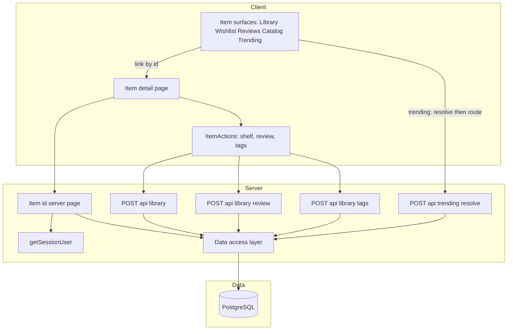
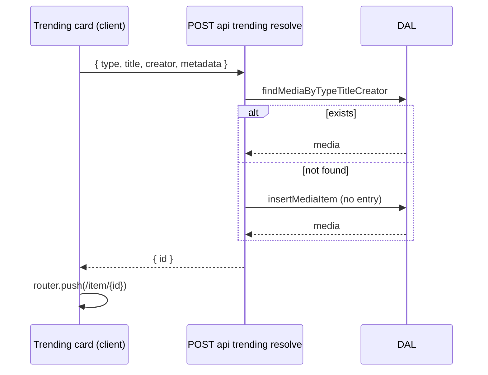

# Technical Design — media-detail

## Overview

**Purpose**: Add a per-item **detail page** to LibraryLoop — a dedicated, authenticated surface showing an item's full metadata and description, with actions to place it on a shelf (wishlist / currently reading / read) and add/edit a review (and tags). It's reachable from every surface that lists an item (Library, Wishlist, Reviews, the catalog/add flow, and Trending).

**Users**: Signed-in readers who want one place to view and manage a given item.

**Impact**: Additive — a new dynamic route (`/item/[id]`), a server data loader composing existing DAL reads, a client actions panel composing **existing** authenticated endpoints (`/api/library`, `/api/library/review`, `/api/library/tags`), cross-surface links, and **one** thin new endpoint to resolve an external trending item to a catalog id. No schema change; no change to existing routes, contracts, auth/session/middleware, or per-user authorization. Build, type-check, and tests stay green.

### Goals
- A stable `/item/[id]` page rendering full item info + the user's status/rating/review/tags, on the v2 design system.
- Shelf + review (+ tags) actions that reuse existing endpoints and reflect immediately.
- Links from all item surfaces; a non-broken path from an external trending item to its detail.

### Non-Goals
- New persistence/schema, or new write contracts for owned/catalog items (reuse existing).
- A separate "preview" detail mode for unsaved items (resolve to a real id instead).
- Spotify user-OAuth / library import (separate, deferred).

## Architecture

### Existing Architecture Analysis
- **Server-read / client-mutate**: server components read via the DAL; client components mutate via Route Handlers gated by `getSessionUser()`; middleware gates `(app)` routes.
- **Reusable**: `findMediaById`, `findEntry(userId, mediaItemId)`, `listTagsByEntryIds` (reads); `/api/library` (shelf upsert + activity), `/api/library/review`, `/api/library/tags` (writes); `findMediaByTypeTitleCreator` + `insertMediaItem` (resolve); `sendJson`; `formatMetaLine`, `mediaTypeLabel`, `StarRating`, design-system primitives; the shelf/review/tags client pattern in `LibraryCard`.
- **Constraint**: `saveReview`/tags target an existing `library_entries` row, so reviewing requires an entry.

### Architecture Pattern & Boundary Map
**Pattern**: a new presentation surface over existing boundaries. No new domain/data layer except a thin resolve endpoint.



**Integration**:
- Selected pattern: reuse-and-compose — lowest blast radius, satisfies Req 10.
- New components: the route/page, the `ItemActions` client panel, surface links, and the single `resolve` endpoint.
- Preserved: session-derived authorization, server/client split, design-system rendering, existing endpoint contracts.

### Technology Stack

| Layer | Choice | Role | Notes |
|-------|--------|------|-------|
| Frontend | Next.js App Router dynamic route + shadcn/tokens | `/item/[id]` page + `ItemActions` | server page, client actions |
| Backend | Existing Route Handlers | shelf/review/tags writes | reused unchanged |
| Backend | New `POST /api/trending/resolve` | external→catalog id (find-or-create, no entry) | thin; reuses DAL |
| Data | PostgreSQL + Drizzle (existing) | reads via DAL | no schema change |
| Testing | Vitest + pglite + Testing Library | resolve + create-then-review + page render | no live calls |

No new runtime dependencies.

## System Flows

### Trending item → detail (resolve)


### Reviewing an item not yet in the library
The review/tags controls require an entry. If absent, `ItemActions` first POSTs `/api/library` (shelf upsert → creates the entry), then POSTs the review/tags. With an entry present, it edits in place.

## Requirements Traceability

| Requirement | Summary | Components | Interfaces |
|-------------|---------|------------|------------|
| 1.1–1.5 | Authenticated `/item/[id]` route + nav/back, no 404 | `item/[id]` page, middleware, back link | server props |
| 2.1–2.5 | Full info display (metadata, description, artwork, user state) | page + `ItemDetail` view; `formatMetaLine` | — |
| 3.1–3.5 | Shelf actions reflect + persist + activity | `ItemActions` | `POST /api/library` |
| 4.1–4.5 | Add/edit review (1–5 + text), validated, reflected | `ItemActions` review form | `POST /api/library/review` |
| 5.1–5.3 | Edit tags | `ItemActions` tags field | `POST /api/library/tags` |
| 6.1–6.4 | Links from surfaces, inline actions preserved | links in Library/Wishlist/Reviews/`MediaCard`/`TrendingCard` | — |
| 7.1–7.3 | Trending/external resolution path | `TrendingCard` "View details", resolve endpoint | `POST /api/trending/resolve` |
| 8.1–8.4 | Loading / not-found / action errors | page (`notFound()`), `ItemActions` | — |
| 9.1–9.4 | Responsive + accessible (light/dark, keyboard, not-color-only) | all detail components | — |
| 10.1–10.4 | Reuse endpoints; preserve boundaries/quality | all | — |

## Components and Interfaces

| Component | Layer | Intent | Req | Contracts |
|-----------|-------|--------|-----|-----------|
| `/item/[id]` page | UI (server) | Load + render one item for the user | 1,2,8 | State |
| `ItemDetail` view | UI | Presentational layout of metadata/description | 2,9 | State |
| `ItemActions` | UI (client) | Shelf/review/tags via existing endpoints | 3,4,5 | State |
| Surface links | UI | Link items → detail; keep inline actions | 6 | — |
| `POST /api/trending/resolve` | API | External item → catalog id (find-or-create) | 7 | API |
| `resolveTrendingMedia` (lib) | Domain/Data | find-or-create media, no entry | 7.2 | Service |

### `/item/[id]` page (server)
- Gate via `getSessionUser()` (redirect to `/login` if absent). Load `findMediaById(id)`; if null → `notFound()` (Req 8.2). Load `findEntry(user.id, id)` and `listTagsByEntryIds([entry.id])` when an entry exists. Pass `{ item, entry, tags }` to `ItemDetail` + `ItemActions`.
- Renders title, creator, type badge, `formatMetaLine`, description, artwork/fallback, current status/rating/review/tags (Req 2). Includes a back affordance (Req 1.5).

### `ItemActions` (client)
**Contracts**: State [x]
```typescript
interface ItemActionsProps {
  mediaItemId: string;
  entry: { id: string; status: LibraryStatus; rating: number | null; review: string } | null;
  tags: string[];
}
```
- **Shelf**: buttons for wishlist / currently reading / read → `POST /api/library { mediaItemId, status }` → `router.refresh()` (Req 3). Reflects current status.
- **Review**: 1–5 select + textarea; enabled when `entry` exists, else a prompt to add to a shelf first. Save → `POST /api/library/review { entryId, rating, review }` (Req 4). Client validates the 1–5 integer before sending (Req 4.5).
- **Tags**: comma input; save → `POST /api/library/tags { entryId, tags }` (Req 5), normalized server-side.
- Errors from `sendJson` surfaced via `role="alert"` without losing input (Req 8.3); inputs keyboard-operable with focus ring (Req 9.3).

### `POST /api/trending/resolve` + `resolveTrendingMedia`
**Contracts**: API [x] / Service [x]
| Method | Endpoint | Request | Response | Errors |
|--------|----------|---------|----------|--------|
| POST | /api/trending/resolve | `{ type, title, creator, genre?, metadata? }` | `{ id }` | 400, 401, 500 |
```typescript
// lib (reuses findMediaByTypeTitleCreator + insertMediaItem; NO library entry)
function resolveTrendingMedia(db: DbExecutor, input: ResolveInput): Promise<{ id: string; created: boolean }>;
```
- Session-gated; validates payload (reuse `validateAddTrending`-style); find-or-create the media row only; returns its id. The Trending "View details" action calls it then `router.push("/item/" + id)` (Req 7.1–7.2). From the detail page the user can add to a shelf (Req 7.3). Best-effort de-dup (DL-64 caveat).

### Surface links (Req 6)
- `MediaCard`/`LibraryCard` (Library, Wishlist, Reviews) and the catalog list: make the title (and/or a "Details" affordance) an accessible link to `/item/[id]`; keep the existing inline actions (the ⋮ menu / shelf controls) intact.
- `TrendingCard`: add a "View details" control that resolves then routes (above).

## Data Models
No schema change. Detail data is composed from existing `media_items` + `library_entries` (+ entry tags) via the DAL. The resolve endpoint inserts only into `media_items` (existing table) when no match exists.

## Error Handling
- **Page**: unknown id → `notFound()` (accessible not-found UI, Req 8.2); unauthenticated → redirect to `/login` (Req 1.4).
- **Actions**: reuse the standard `ApiError` envelope; `ItemActions` shows inline `role="alert"` errors and keeps input (Req 8.3); a failed action never breaks other routes (Req 8.4).
- **Resolve**: `badRequest` on invalid payload, `serverError` on DB failure, `unauthorized` without a session.

## Testing Strategy
- **Integration (pglite)**: `resolveTrendingMedia` — find-or-create + de-dup (no library entry created); cross-user neutrality.
- **Integration**: create-then-review ordering — reviewing an un-added item creates the entry then saves the review; existing-entry edit updates in place.
- **UI (Testing Library)**: detail renders title/creator/meta/description/status/tags; review disabled→prompt when no entry; shelf/review controls have accessible names; not-found state renders for a missing item.
- **Regression**: existing endpoints/contracts unchanged; inline card actions still work; build/typecheck/tests green.

## Security Considerations
- The page and resolve endpoint derive the user from the session; shelf/review/tags writes remain per-user via the existing endpoints (Req 10.2). Externally-sourced text rendered as text; artwork https-only (Req 10.4). No new secrets.

## Open Questions / Risks
- Whether to extract the shared shelf/review/tags client logic from `LibraryCard` into a hook reused by `ItemActions` (optional DRY cleanup; not required for delivery).
- Resolve-on-view grows the shared catalog under the same TOCTOU caveat as add (tracked by DL-64).
