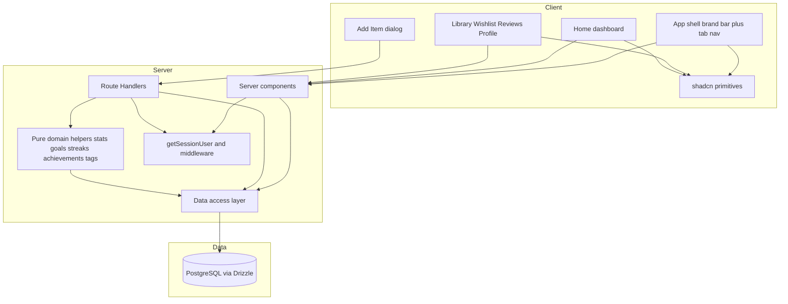
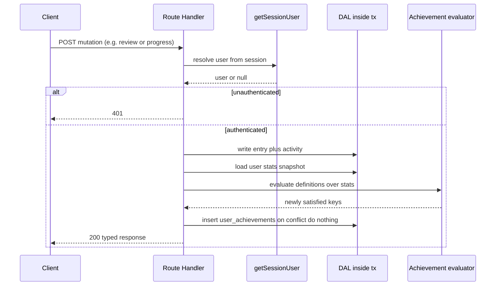
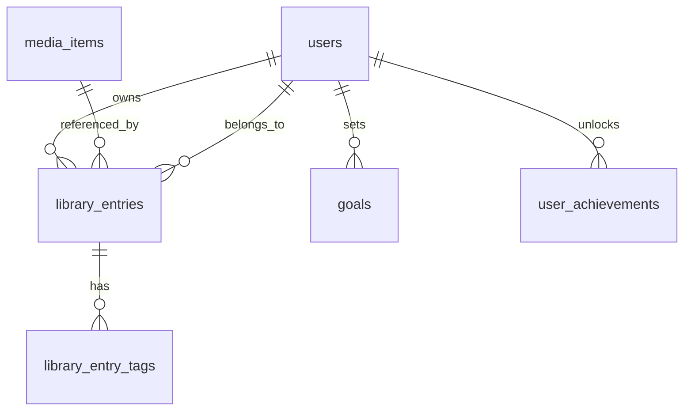
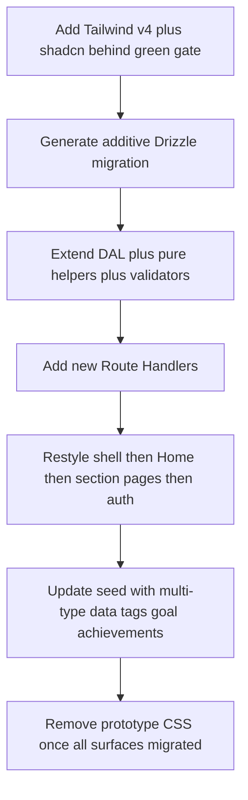

# Technical Design — media-platform-v2

## Overview

**Purpose**: media-platform-v2 evolves LibraryLoop from a books-only app into a multi-media library (e-books, music, podcasts, TV/movies) with tags, consumption progress, reading goals, activity streaks, and achievements — and re-skins every surface with the reference "Media Manager" design system (Tailwind v4 + shadcn/ui, light + dark). The Home page becomes a live goals/stats/achievements dashboard while retaining the community feed.

**Users**: Authenticated members manage a typed, tagged collection and track progress/goals/streaks/achievements; all readers see a restyled, accessible, responsive UI matching the reference.

**Impact**: Extends the existing Next.js (App Router) + Postgres/Drizzle app **additively and non-breakingly**. The data schema, DAL, and API gain new tables/columns/handlers; the styling layer is replaced (plain CSS → Tailwind v4 + shadcn). Auth/session/middleware, server/client boundaries, per-user authorization, validation discipline, and every existing endpoint contract are preserved. Build, typecheck, and the test suite stay green.

### Goals
- Persist and surface multiple media types with type-specific metadata, tags, and consumption progress — additive to the open `media_items.type` model.
- Compute live per-user stats, goal progress, streaks, and achievements, exposed through the typed DAL/API and rendered on a redesigned Home dashboard.
- Implement the reference design system (tokens, primitives, shell, cards) with Tailwind v4 + shadcn/ui in both themes, across the reference IA (Home / Library / Wishlist / Reviews + Profile).
- Keep all existing routes, contracts, auth behavior, and tests intact; add tests for new behavior.

### Non-Goals
- NYT recommendations (owned by the `nyt-recommendations` spec) and Google SSO (future release; schema already SSO-ready).
- Re-ranking, social graph, or notifications.
- Editing tags/metadata on **shared catalog** media owned by other users (tags are user-scoped to the acting user's entry).
- A bespoke icon set or webfont (reference uses system fonts + lucide icons).

## Architecture

### Existing Architecture Analysis
- **Layered, server-first**: server components read through a typed DAL (`src/db/queries.ts`, all helpers take `DbExecutor`); client components mutate via Route Handlers (`src/app/api/**`) that gate on `getSessionUser()`, validate with pure validators, and return `NextResponse<T | ApiError>`.
- **Open data model**: `media_items.type` defaults `ebook` and is unconstrained (no per-type schema lock-in); `library_entries` is the per-user join carrying status/rating/review with unique `(userId, mediaItemId)`.
- **Centralized contracts**: domain + API types in `src/lib/types`; pure computed-view helpers (`home-stats`, `media-type`, `library-view`, `catalog-view`) are unit-tested without a DB.
- **Constraints to respect**: edge middleware + server `getSessionUser()` gating; `(app)`/`(auth)` route groups; Node runtime for handlers; Drizzle query builder only (no raw SQL); no `any`; secrets via env; no `dangerouslySetInnerHTML`.
- **Styling debt addressed**: hand-written `globals.css` (prototype port) is replaced by the Tailwind v4 + shadcn token system.

### Architecture Pattern & Boundary Map
**Pattern**: additive extension of the existing layered app. New domain logic lives in pure helpers + DAL functions; new persistence in new tables/columns; new UI in a shadcn primitive layer + restyled feature components. No existing boundary moves.



**Architecture Integration**:
- Selected pattern: additive layered extension — lowest blast radius, satisfies Req 14–15.
- Boundaries: new domain helpers (`goals`, `streaks`, `achievements`, `stats`, `tags`, `media-metadata`) are pure and testable; DAL helpers are additive; handlers mirror the existing template; UI splits into a shadcn primitive layer (`src/components/ui`) and feature components.
- Preserved patterns: session-derived authorization, `DbExecutor` injection, validator→DAL→typed-response flow, data-driven nav, server/client split.
- New components rationale: each maps to a new capability (types/tags/progress/goals/streaks/achievements) or a restyled surface; see Components.
- Steering compliance: no `any`; Drizzle-only; env secrets; accessibility preserved; additive migrations.

### Technology Stack

| Layer | Choice / Version | Role in Feature | Notes |
|-------|------------------|-----------------|-------|
| Frontend | Tailwind CSS v4 (`tailwindcss` + `@tailwindcss/postcss` + `postcss`) | Design-system utility layer | CSS-first `@theme inline`; replaces hand-written CSS |
| Frontend | shadcn/ui primitives (copied into repo) | Card, Button, Badge, Tabs, Progress, DropdownMenu, Dialog, Input, Textarea, Label, Select, Avatar | React 19-ready, `data-slot`; under repo TS/lint |
| Frontend | `@radix-ui/*`, `class-variance-authority`, `clsx`, `tailwind-merge`, `lucide-react` | shadcn peer deps + icons | MIT; React 19 compatible |
| Frontend | next-themes (or minimal class toggle) | light/dark via `prefers-color-scheme` + `.dark` | Default to OS preference (Req 9.2) |
| Backend | Next.js 15 Route Handlers (existing) | New endpoints for goals/progress/tags | Same template, `runtime = "nodejs"` |
| Data | PostgreSQL + Drizzle ORM (existing) | New tables + nullable columns via versioned migration | Additive only (Req 14.1/14.5) |
| Testing | Vitest + Testing Library + pglite (existing) | Unit (pure helpers) + integration (DAL/handlers on pglite) | Migrations applied to pglite in tests |

New runtime dependencies: `tailwindcss`, `@tailwindcss/postcss`, `postcss`, `class-variance-authority`, `clsx`, `tailwind-merge`, `lucide-react`, `@radix-ui/*` (per primitive), optionally `next-themes`. Deviations from current stack: introduces a CSS framework where none existed; no other stack change.

## System Flows

### Achievement unlock on a qualifying write

Unlock evaluation runs only on write paths (post-mutation), is idempotent, and never blocks the primary response semantics (failure to record an unlock degrades gracefully and is logged, not surfaced as a user error).

### Home dashboard read (live stats)
Home server component loads, in parallel for the session user: library entries (+joined media), activities, the active goal, and persisted achievements; pure helpers derive stat cards, goal progress, streaks, and achievement state; the feed is read as today. No client fetch is added for the dashboard (server-rendered).

## Requirements Traceability

| Requirement | Summary | Components | Interfaces | Flows |
|-------------|---------|------------|------------|-------|
| 1.1–1.5 | Multi-type media + metadata | `media-metadata` helper, `MediaItem` type, schema `metadata`/`totalUnits`, `MediaCard` | `MediaItemMetadata` union; `mediaTypeLabel` | — |
| 2.1–2.4 | Free-form tags | `library_entry_tags`, tags DAL, `validateTags`, `MediaCard` tags | `POST /api/library/tags`; `TagsResponse` | — |
| 3.1–3.4 | Progress + stats | `stats` helper, progress column, `StatCards` | `PATCH /api/library/progress`; `computeUserStats` | Home read |
| 4.1–4.4 | Reading goals | `goals` table + DAL + helper, `GoalCard` | `GET/PUT /api/goals`; `computeGoalProgress` | Home read |
| 5.1–5.3 | Streaks | `streaks` helper (from activities), `StreakCard` | `computeStreaks` | Home read |
| 6.1–6.4 | Achievements | `achievements` catalog + evaluator, `user_achievements`, `AchievementsSection` | `evaluateAchievements`; unlock write | Unlock flow |
| 7.1–7.5 | Home dashboard | Home page, `DashboardHeader`, `StatCards`, `AchievementsSection`, `Feed` | server props | Home read |
| 8.1–8.4 | Enriched cards + filter | `MediaCard`, `MediaTypeFilter`, `media-type` helper | `MediaTypeOption[]`, counts | — |
| 9.1–9.4 | Design-system foundation | `globals.css` `@theme`, `src/components/ui/*`, `ThemeProvider` | token CSS vars | — |
| 10.1–10.4 | Shell + nav | `AppShell`, `BrandBar`, `TabNav`, `NAV_ITEMS` | `isNavItemActive` | — |
| 11.1–11.7 | Section pages + auth | `/library` `/wishlist` `/reviews` `/profile`, auth pages, `AddItemDialog` | section-view helpers | — |
| 12.1–12.3 | Responsive | all surfaces (Tailwind breakpoints) | — | — |
| 13.1–13.5 | Accessibility | all components; `aria-current`, focus-visible | — | — |
| 14.1–14.5 | Backend/data extensions | migration, DAL, handlers, seed | endpoints below | unlock + read |
| 15.1–15.4 | Architecture/quality preserved | all (boundaries, types, tests) | — | — |

## Components and Interfaces

| Component | Domain/Layer | Intent | Req Coverage | Key Dependencies (P0/P1) | Contracts |
|-----------|--------------|--------|--------------|--------------------------|-----------|
| `media-metadata` helper | Domain | Parse/format type-specific metadata | 1.1–1.5 | domain types (P0) | State |
| Tags DAL + `tags` helper | Domain/Data | Read/write user-scoped tags | 2.1–2.4 | `DbExecutor` (P0) | Service, API |
| `stats` helper | Domain | Aggregate per-user stats incl. pages read | 3.1–3.4 | entries (P0) | Service |
| `goals` table + DAL + helper | Domain/Data | Persist goal; compute progress | 4.1–4.4 | `DbExecutor` (P0) | Service, API, State |
| `streaks` helper | Domain | Current/longest streak from activity | 5.1–5.3 | activities (P0) | Service |
| `achievements` catalog + evaluator | Domain | Define + evaluate + persist unlocks | 6.1–6.4 | stats (P0), DAL (P0) | Service, State |
| Progress DAL + endpoint | Data/API | Record consumption progress | 3.1, 14.2 | entries (P0) | API |
| Design tokens + `src/components/ui/*` | UI | shadcn primitives from reference tokens | 9.1–9.4 | Tailwind v4 (P0), Radix (P1) | State |
| `AppShell` / `BrandBar` / `TabNav` | UI | Reference shell + horizontal nav | 10.1–10.4 | `NAV_ITEMS` (P0) | State |
| `MediaCard` + `MediaTypeFilter` | UI | Reference card anatomy + typed filter | 8.1–8.4, 1.3 | primitives (P0) | State |
| Home dashboard components | UI | Header, stat cards, achievements, feed | 7.1–7.5 | server props (P0) | State |
| Section pages + `AddItemDialog` | UI | Library/Wishlist/Reviews/Profile + add flow | 11.1–11.7 | handlers (P0) | State |
| `ThemeProvider` | UI | OS-default light/dark | 9.2, 13.2 | next-themes (P1) | State |

Detailed blocks below cover only components introducing new boundaries. Presentational components rely on the summary row plus the shared props base.

### Domain / Data layer

#### Tags (DAL + helper)
| Field | Detail |
|-------|--------|
| Intent | Persist and expose user-scoped, free-form tags on a library entry |
| Requirements | 2.1, 2.2, 2.3, 2.4 |

**Responsibilities & Constraints**
- Tags belong to the acting user's `library_entry`, never the shared `media_item`.
- Normalize: trim, lowercase, de-dupe; cap count (e.g. ≤ 20) and length (e.g. ≤ 32) at the validator.
- Reads aggregate tags per entry into `string[]` for DTOs.

**Dependencies**: Inbound — library/section pages, `AddItemDialog` (P0). Outbound — `DbExecutor` (P0). External — none.

**Contracts**: Service [x] / API [x] / State [ ]

##### Service Interface
```typescript
interface TagsRepository {
  listTagsByEntryIds(db: DbExecutor, entryIds: string[]): Promise<Map<string, string[]>>;
  setEntryTags(db: DbExecutor, input: { entryId: string; userId: string; tags: string[] }): Promise<string[]>;
}
```
- Preconditions: `entryId` belongs to `userId` (verified via join in the write).
- Postconditions: entry's tag set equals the normalized input (full replace).
- Invariants: tags unique per entry; only the owner can mutate.

##### API Contract
| Method | Endpoint | Request | Response | Errors |
|--------|----------|---------|----------|--------|
| POST | /api/library/tags | `{ entryId: string; tags: string[] }` | `{ entryId: string; tags: string[] }` | 400, 401, 404, 500 |

**Implementation Notes**
- Integration: write inside a tx; verify ownership by `(entryId, userId)` before replacing tags.
- Validation: `validateTags` returns normalized `string[]` or null → 400.
- Risks: tag explosion — enforce caps; lowercase to avoid duplicate-casing.

#### Goals (table + DAL + helper)
| Field | Detail |
|-------|--------|
| Intent | Persist a per-user periodic goal and compute progress |
| Requirements | 4.1, 4.2, 4.3, 4.4 |

**Responsibilities & Constraints**: one active goal per `(user, period, period_key)`; progress = finished items in the period vs target; default/prompt when unset (4.4).

**Contracts**: Service [x] / API [x] / State [x]

##### Service Interface
```typescript
interface GoalProgress {
  target: number;
  completed: number;
  remaining: number;     // max(0, target - completed)
  period: "year";
  periodKey: string;     // e.g. "2026"
}
interface GoalsRepository {
  getActiveGoal(db: DbExecutor, userId: string, period: string, periodKey: string): Promise<Goal | null>;
  upsertGoal(db: DbExecutor, input: { userId: string; period: string; periodKey: string; targetCount: number }): Promise<Goal>;
}
function computeGoalProgress(goal: Goal | null, finishedInPeriod: number): GoalProgress | null;
```
- Postconditions: `upsertGoal` is idempotent on `(user, period, period_key)`.
- Invariants: `targetCount >= 1`; progress never negative.

##### API Contract
| Method | Endpoint | Request | Response | Errors |
|--------|----------|---------|----------|--------|
| GET | /api/goals | — (query `?period=&key=`) | `{ goal: Goal \| null; progress: GoalProgress \| null }` | 401, 500 |
| PUT | /api/goals | `{ period: string; periodKey: string; targetCount: number }` | `{ goal: Goal; progress: GoalProgress }` | 400, 401, 500 |

**Implementation Notes**: validate `targetCount` integer ≥ 1; default period `year` + current year when omitted; progress recomputed from the DAL on read.

#### Stats & Streaks (pure helpers)
| Field | Detail |
|-------|--------|
| Intent | Derive live dashboard numbers from the user's own data |
| Requirements | 3.1–3.4, 5.1–5.3 |

**Contracts**: Service [x]
```typescript
interface UserStats {
  counts: { wishlist: number; current: number; finished: number; reviewed: number };
  totalPagesRead: number;          // sum of progress where applicable
  inProgress: number;              // current-status count
}
interface StreakInfo { current: number; longest: number }

function computeUserStats(entries: LibraryEntryWithMedia[]): UserStats;
function computeStreaks(activityDates: ReadonlyArray<string>, today: string): StreakInfo;
```
- Pure + deterministic (today injected, never `new Date()` inside) → unit-testable.
- Scoped to one user's entries/activities by the caller (Req 3.4, 5.3).

> `home-stats.ts` is upgraded from `mockHomeStats()` to these live computations; `HomeStats` shape extended (no consumer break — Home reads server-side).

#### Achievements (catalog + evaluator + persistence)
| Field | Detail |
|-------|--------|
| Intent | Define achievements, evaluate against user stats, persist first unlock |
| Requirements | 6.1, 6.2, 6.3, 6.4 |

**Responsibilities & Constraints**: definitions are static code (key, title, description, `predicate(stats, streaks, goalProgress)`); persisted `user_achievements` captures `achieved_at`; read computes unlocked vs in-progress + count.

**Contracts**: Service [x] / State [x]
```typescript
interface AchievementDef {
  key: string;
  title: string;
  description: string;
  predicate: (ctx: AchievementContext) => boolean;
  progress?: (ctx: AchievementContext) => { current: number; target: number };
}
interface AchievementView {
  key: string; title: string; description: string;
  unlocked: boolean; achievedAt: string | null;
  progress: { current: number; target: number } | null;
}
function evaluateAchievements(ctx: AchievementContext, unlocked: Map<string, string>): AchievementView[];
function newlyUnlockedKeys(ctx: AchievementContext, alreadyUnlocked: Set<string>): string[];
```
- Postconditions: `newlyUnlockedKeys` returns only keys satisfied now and not previously unlocked.
- Invariants: unlock is monotonic (persisted rows never removed); evaluation pure.

**Implementation Notes**: write handlers call `newlyUnlockedKeys` post-mutation and `insert ... on conflict do nothing` into `user_achievements`; read paths stay pure. Count "X of N" from definitions length.

#### New/extended Route Handlers (summary)
All follow the existing template: `getSessionUser()` gate → parse → pure validator → DAL (tx where it also writes activity/unlocks) → typed `NextResponse<T | ApiError>`; `runtime = "nodejs"`; user derived from session only (Req 14.3).

| Method | Endpoint | Purpose | Req |
|--------|----------|---------|-----|
| POST | /api/library/tags | Replace an entry's tags | 2.3 |
| PATCH | /api/library/progress | Record consumption progress for an entry | 3.1 |
| GET / PUT | /api/goals | Read / set the active goal | 4.1–4.3 |
| (extend) | /api/media (POST), /api/library/review (POST) | Accept type + metadata + tags; trigger unlock evaluation | 1.2, 2.3, 6.2 |

Existing endpoints keep their current contracts; new fields on `/api/media` are optional/back-compatible.

### UI layer

#### Design tokens + shadcn primitives (`src/components/ui/*`)
- `globals.css`: `@import "tailwindcss";` + `@theme inline { … }` carrying the reference tokens from `design-reference.md` (`--background`, `--foreground`, `--primary`, `--muted`, `--border`, `--radius: 0.625rem`, chart/sidebar tokens) and a `.dark { … }` override; system font stacks; `--default-transition-duration`.
- Primitives scaffolded via `components.json`: `Button`, `Card`, `Badge`, `Tabs`, `Progress`, `DropdownMenu`, `Dialog`, `Input`, `Textarea`, `Label`, `Select`, `Avatar`. Implementation Note: these are copied source under repo TS/lint; no `any`; `data-slot` styling.

#### Shared UI props base
```typescript
interface BaseSurfaceProps { className?: string }
interface MediaCardProps extends BaseSurfaceProps {
  item: MediaItem;                 // includes type + parsed metadata
  entry?: LibraryEntry;            // present for owned items
  tags: string[];
  rating: number | null;
  onAction?: (action: CardAction) => void; // move shelf / review (client)
}
```

#### Restyled shell & navigation (`AppShell`, `BrandBar`, `TabNav`) — summary
- Top brand bar (logo tile + "Media Manager" + tagline) with a primary **"+ Add Item"** action and profile access; below it a horizontal **tab nav** (icon + label) Home/Library/Wishlist/Reviews with `aria-current` active state (Req 10.1–10.2, 13.1). Reflows without horizontal overflow at mobile widths (Req 10.3, 12.2). `NAV_ITEMS` relabeled + extensible; sign-out preserved (Req 10.4).

#### MediaCard + MediaTypeFilter — summary
- Card: type pill (color per type), status pill, title, creator, type-appropriate meta line, gold star rating, optional review snippet, tag pills, accessible `⋮` actions menu (DropdownMenu) — matches reference anatomy (Req 8.1, 8.3). Status/rating/achievement conveyed by text + icon, not color alone (Req 13.5).
- Filter: segmented control built from `mediaTypeOptions` with per-type counts + "All" default; no per-type branching (Req 8.2, 8.4). `media-type.ts` extended with type→color/icon mapping (data-driven, with humanized fallback for unknown types — Req 1.5).

#### Home dashboard components — summary
- `DashboardHeader` (greeting), `StatCards` (goal w/ progress bar + caption, total pages read w/ progress, current streak, in-progress — Req 7.1, 7.3), `AchievementsSection` (unlocked/in-progress sub-grids + "X of N" — Req 7.2), and the retained `Feed` (Req 7.4). All fed by live server props (Req 7.5).

#### Section pages + AddItemDialog — summary
- `/library` (full collection + `MediaTypeFilter` + per-item actions, preserving shelf behavior — Req 11.1), `/wishlist` (wishlist-status items + shelf moves — Req 11.2), `/reviews` (reviewed items + edit review — Req 11.3), `/profile` (editable profile + preferences from brand bar — Req 11.5). `AddItemDialog` provides catalog search **and** custom add of any type incl. tags (Req 11.4, 11.7), preserving prior Catalog/Shelves capability. Auth pages restyled, errors accessible, no signed-in shell (Req 11.6). Section-view helpers (`library-view`, `catalog-view`) extended to wishlist/reviews filters.

## Data Models

### Domain Model
- **MediaItem** gains `metadata` (type-specific, discriminated on `type`) and `totalUnits` (total pages/episodes/runtime, nullable).
- **LibraryEntry** gains `progress` (nullable consumption count) and an associated set of **tags** (user-scoped).
- **Goal** aggregate: one per `(user, period, periodKey)`.
- **Achievement**: definitions in code; **UserAchievement** persists unlock `(userId, key, achievedAt)`.
- **Streak**: derived value object from `activities` (no table).

### Logical Data Model (new / changed)

- `media_items` (changed): `+ metadata jsonb null`, `+ total_units integer null`. Existing columns unchanged; existing rows valid (NULL extras).
- `library_entries` (changed): `+ progress integer null` with check `progress is null or progress >= 0`.
- `library_entry_tags` (new): `id uuid pk`, `entry_id uuid fk→library_entries cascade`, `tag text not null`, unique `(entry_id, tag)`, index `(entry_id)`.
- `goals` (new): `id uuid pk`, `user_id uuid fk→users cascade`, `period text not null`, `period_key text not null`, `target_count integer not null check >= 1`, `created_at timestamptz default now()`, unique `(user_id, period, period_key)`.
- `user_achievements` (new): `id uuid pk`, `user_id uuid fk→users cascade`, `achievement_key text not null`, `achieved_at timestamptz not null default now()`, unique `(user_id, achievement_key)`, index `(user_id)`.

**Consistency & Integrity**: all writes scoped by `user_id`; cascades from `users`/`library_entries`; goal & achievement uniqueness make upserts/unlocks idempotent. One additive Drizzle migration (`db:generate`), applied on deploy by the existing `db:migrate` step (Req 14.1/14.5).

### Data Contracts & Integration
- **Type-specific metadata** validated into a discriminated union at the boundary:
```typescript
type MediaItemMetadata =
  | { kind: "ebook"; pages?: number }
  | { kind: "music"; album?: string }
  | { kind: "podcast"; show?: string; episodeCount?: number }
  | { kind: "tv_movie"; runtimeMinutes?: number; seasons?: number };
```
`MediaItem.metadata` is parsed/validated (never read as `any`); unknown `type` → empty metadata + humanized label (Req 1.5).
- **DTO additions** (backward-compatible): `MediaItem` gains optional `metadata`/`totalUnits`; library/section DTOs gain `tags: string[]` and `progress: number | null`. `FeedEntryDTO` unchanged. New responses: `TagsResponse`, `GoalResponse`, `StatsResponse` (or folded into the Home server read). Existing response shapes are not altered destructively.

## Error Handling

### Error Strategy
Reuse the existing envelope (`apiError`/`badRequest`/`unauthorized`/`serverError`, `ApiError`). New handlers follow the same fail-fast validation and typed responses.

### Error Categories and Responses
- **User errors (4xx)**: invalid goal target / malformed tags → 400 with message; unauthenticated → 401; tagging an entry not owned or missing → 404. Auth/section forms render field-level + request errors accessibly (Req 11.6, 13).
- **System errors (5xx)**: DB failures → 500 generic message; writes wrapped in `db.transaction` so partial state never persists.
- **Business-logic**: goal target < 1 rejected at validation; achievement unlock failures are logged and do **not** fail the user's primary action (graceful degradation).

### Monitoring
Server-side `console.error` on caught failures (existing convention); unlock-evaluation failures logged distinctly so they're observable without affecting UX.

## Testing Strategy

### Unit Tests (pure helpers)
- `computeUserStats` — counts + total pages across mixed media/progress.
- `computeStreaks` — current/longest across gaps; injected `today`.
- `computeGoalProgress` — remaining clamped at 0; null goal → null.
- `evaluateAchievements` / `newlyUnlockedKeys` — unlock monotonicity + idempotence.
- `media-metadata` parse — each type + unknown-type fallback (Req 1.5); tag normalization caps.

### Integration Tests (pglite, migrations applied)
- Tags: set/replace tags only on owned entries; cross-user write → 404; read aggregates `string[]`.
- Goals: PUT then GET returns idempotent goal + recomputed progress.
- Progress: PATCH updates entry; stats reflect it; rejects negative.
- Achievement unlock: a qualifying review/finish inserts exactly one `user_achievements` row; repeat is a no-op.
- Regression: existing media/library/review/profile/activities endpoints keep their contracts; e-book rows with NULL metadata still render.

### E2E/UI Tests (Testing Library / jsdom)
- Shell renders tab nav with `aria-current`; mobile reflow has no clipped controls.
- `MediaCard` renders type/status/rating/tags + accessible `⋮` menu; status/rating not color-only.
- `MediaTypeFilter` shows counts + "All" default and filters without per-type branches.
- Home dashboard renders live stat cards, goal progress bar, achievements "X of N", and the feed.
- Dark theme applies via `.dark`; focus-visible present.

## Security Considerations
- Every new endpoint gates on `getSessionUser()` and derives the user from the session only; all reads/writes scoped to that user's rows (Req 14.3) — verified by cross-user integration tests.
- No new secrets; any future external keys stay in env (Req 15.4).
- User-supplied tags/reviews/metadata rendered as text; no `dangerouslySetInnerHTML` (Req 15.4). Tag/metadata inputs validated + length-capped at the boundary.

## Accessibility & Responsive (feature-specific)
- Preserve roles/labels/`aria-current`; visible focus-visible from the token system (Req 13.1, 13.3).
- AA contrast verified in both themes using the reference tokens; status/rating/achievement/progress conveyed by text + icon, not color alone (Req 13.2, 13.5).
- Honor `prefers-reduced-motion` for the reference's transitions/pulse (Req 13.4).
- Tailwind breakpoints drive nav + card-grid reflow; tap targets sized for mobile (Req 12).

## Migration Strategy

- Rollback triggers: build/typecheck/test failure at any step halts and reverts that step.
- Validation checkpoints: green gate after the framework lands; contract regression tests after schema/API; visual + a11y review after each surface.
- Data: migration is purely additive (new tables + nullable columns) and applies on deploy via the existing `db:migrate` step; existing e-book data remains valid (Req 14.5). Seed extended to multi-type catalog + tags + a demo goal + demo achievements (Req 14.4).
