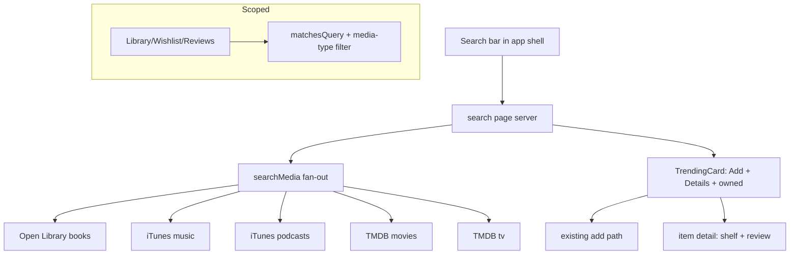
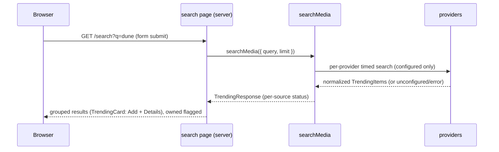

# Design Document

## Overview

**Purpose**: Add (1) a global search bar that queries all configured external providers across every media type and lists the results with add/detail actions, and (2) a scoped search on Library/Wishlist/Reviews that filters the items already on the page.

**Users**: Signed-in readers searching for new media (global) or finding an item in their own collection (scoped).

**Impact**: Additive. Global search is the **trending fan-out with a query**: a `SearchProvider` port + concurrent `searchMedia` returning the existing `TrendingResponse`, rendered with the existing `TrendingCard` (Add + Details + owned). It reuses the add, cover-art, ownership, and media-detail features; no schema change and **no new secret** (TMDB key already exists; the rest are keyless). Scoped search is a pure in-memory filter composed with the existing media-type filter. The `/search` page runs server-side (no new client API route).

### Goals
- One search bar → unified, source-attributed results across books/music/podcasts/TV-movies, each addable (wishlist) and openable to its detail page (review).
- Scoped title/creator search on Library/Wishlist/Reviews, composing with the media-type filter and persisted in the URL.
- Server-side, resilient (per-source isolation, timeouts, caps, caching); submit-based; no regressions.

### Non-Goals
- A new client-exposed search API (the server component calls the fan-out directly).
- Inline shelf picker on result cards (Add→wishlist + Details, per decision) and full-text/local-catalog global search (external-only, per decision).
- New providers/secrets; Spotify is not required (music via iTunes).

## Architecture

### Existing Architecture Analysis
- **Reuse**: trending `provider`/`feed` fan-out shape; `TrendingItem`/`TrendingResponse`; `TrendingCard` (Add `/api/trending/add`, Details `/api/trending/resolve` → `/item/[id]`); `ownedTrendingKeys`; the media-detail page (shelf + review); `composeShelfItems` + the media-type filter + `typeFilterHrefFactory`; cover-art client patterns (`httpsOrNull`, timed `fetchJson`).
- **Boundaries**: search clients + fan-out in `lib/search`; scoped filter in `lib/library-view`; UI in the shell (`AppNav`) + a `/search` server page + a small `SearchBox`.
- **Steering**: server-side provider calls (secrets in env), https-only media, auth-gated route, typed contracts.

### Architecture Pattern & Boundary Map



**Architecture Integration**: a per-type `SearchProvider` behind `searchMedia` (mirrors trending); results reuse `TrendingCard`; scoped search is an in-memory filter. New components: search clients + fan-out, a `/search` page, a shell `SearchBox`, and a scoped `SearchBox`; plus an optional `detailsFrom` prop on `TrendingCard` and a `search` entry in `itemBackTarget`.

## System Flows



Key decisions: empty/whitespace query → no fan-out, just the empty prompt; each provider isolated (one failing/unconfigured never sinks the others); fetched server-side and cached.

## Requirements Traceability

| Requirement | Summary | Components |
|-------------|---------|------------|
| 1.1, 1.2, 1.3, 1.4 | Shell search bar; submit→URL results; ignore empty; loading/empty states | `SearchBox` (shell) + `/search` page |
| 2.1–2.5 | Aggregate providers; normalized; attributed; grouped; empty-provider ok | `searchMedia` + search clients |
| 3.1–3.5 | Add (wishlist) + details/review; owned flag; non-blocking cover | `TrendingCard` + add/resolve + `ownedTrendingKeys` |
| 4.1–4.5 | Server-side; secrets; degradation; timeouts+caps; caching; auth-gated | search clients + fan-out + `/search` page guard |
| 5.1–5.5 | Scoped title/creator filter; composes with type filter; URL; empty state | `matchesQuery` + Library/Wishlist/Reviews + `SearchBox` |
| 6.1–6.3 | Non-regression; scoped has no external calls; gates green | all; injected-fetch tests |

## Components and Interfaces

| Component | Layer | Intent | Req |
|-----------|-------|--------|-----|
| `SearchProvider` + clients (`lib/search`) | lib | Per-type external search → `TrendingItem[]` | 2, 4 |
| `searchMedia` fan-out (`lib/search`) | lib | Concurrent, per-source-isolated → `TrendingResponse` | 2, 4 |
| `/search` page | app | Server-side: run search, render grouped results | 1, 2, 3, 4 |
| `SearchBox` (shell) | UI | Global `GET` form → `/search?q=` | 1 |
| `matchesQuery` + scoped `SearchBox` | lib + UI | In-memory title/creator filter on the 3 pages | 5 |
| `TrendingCard` `detailsFrom` + `itemBackTarget` `search` | UI/lib | Results' Details deep-link/back to Search | 3.3 |

### lib/search — provider port, clients, fan-out

**Contracts**: Service [x]
```typescript
import type { TrendingItem, TrendingResponse } from "@/lib/types";

export interface SearchFetchOptions { limit: number; fetchImpl?: typeof fetch; }
export interface SearchProvider {
  readonly id: string;
  readonly label: string;
  readonly mediaType: TrendingItem["mediaType"]; // ebook | music | podcast | tv_movie
  isConfigured(env: Record<string, string | undefined>): boolean;
  search(query: string, opts: SearchFetchOptions): Promise<TrendingItem[]>; // may throw; caller isolates
}

export interface SearchFeedOptions {
  query: string;
  limit?: number;
  env?: Record<string, string | undefined>;
  fetchImpl?: typeof fetch;
  providers?: readonly SearchProvider[];
}
// Concurrent fan-out; unconfigured/throwing providers degrade per-source. Empty
// query → { sources: [] } with no upstream calls.
export function searchMedia(opts: SearchFeedOptions): Promise<TrendingResponse>;
```
- Clients (one per type) reuse the cover-art HTTP helper + `httpsOrNull` and pure normalizers → `TrendingItem` (source/sourceLabel/mediaType/title/creator/listLabel/rank/genre/artworkUrl/externalUrl/externalId): Open Library (books, keyless), iTunes (`entity=album` music; `entity=podcast` podcasts, keyless), TMDB (`/search/movie`, `/search/tv`, keyed). Each: timed fetch, defensive parse, capped, never returns non-https artwork.
- `isConfigured`: keyless clients true; TMDB requires `TMDB_API_KEY`.

### app — /search page & shell SearchBox (summary-only)
- **`/search` page** (server, `nodejs`): `getSessionUser` gate; read `q` from `searchParams`; if non-empty, `searchMedia({ query, limit })`; load entries+media for `ownedTrendingKeys`; render the per-source groups with `TrendingCard` (`detailsFrom="search"`), reusing the trending page's status notices + empty/loading states; if `q` empty, show a prompt.
- **`SearchBox` (shell)**: a `<form action="/search" method="get">` with a labeled `q` input, placed in `AppNav`. Submit-based; works without JS.

### Scoped search (summary-only)
- `matchesQuery(item, q)` in `lib/library-view`: true when normalized title or creator contains the normalized query (empty query → true). A `filterShelfItemsByQuery` companion to the existing `filterShelfItemsByType`.
- Library/Wishlist/Reviews: read `?q=` (+ existing `?type=`), apply both filters (type then query); render a `SearchBox` (GET form preserving `type` via a hidden field); reflect `q` in the URL; show the page's empty state when nothing matches. The page's media-type filter links preserve `q` (extend the `typeFilterHrefFactory` `preserve` map).

## Data Models
No schema change. Global search produces transient `TrendingItem`s (persisted only when added, via the existing path). Scoped search filters existing `ShelfItem`s. No new persisted entities.

## Error Handling
- **Global**: provider unconfigured/timeout/error/non-2xx → that source reports its status; others render (Req 2.5, 4.2). Empty query → prompt, no calls. Failures never throw to the page.
- **Scoped**: pure/total; a no-match query → the page's empty state (Req 5.5); never an error.
- **Auth**: unauthenticated `/search` is gated like other app routes (Req 4.5).

## Testing Strategy
### Unit
- Each search client (injected fetch): builds the right query URL/params, normalizes fields + https artwork, caps results, returns `[]` on no-match/non-2xx/timeout; TMDB `isConfigured` by key.
- `searchMedia`: aggregates configured providers; isolates a throwing/unconfigured one; empty query → no calls, `{ sources: [] }`.
- `matchesQuery` / `filterShelfItemsByQuery`: title and creator hits, case/accent-insensitive, empty-query passthrough, composition with the type filter.
### Component
- `SearchBox`: renders a labeled form targeting `/search` (and the scoped variant preserving `type`).
### Non-regression
- Type-check/build; existing trending/add/cover/detail and the media-type filter unaffected; no live provider calls in tests.

## Security Considerations
All provider calls are server-side (TMDB secret from env; others keyless); only https artwork/URLs surface; `/search` is session-gated. Scoped search adds one reflected, in-memory `q` param (used only for case-insensitive matching, rendered as text). No new persisted data; no tokens stored.

## Performance & Scalability
Submit-based (no per-keystroke fan-out); per-provider result caps + timeouts; server-side caching within rate limits; providers run concurrently and are isolated, so adding sources doesn't degrade a query. Scoped search is in-memory over already-loaded data.
