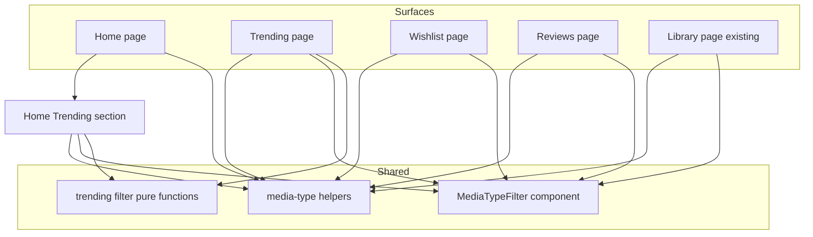
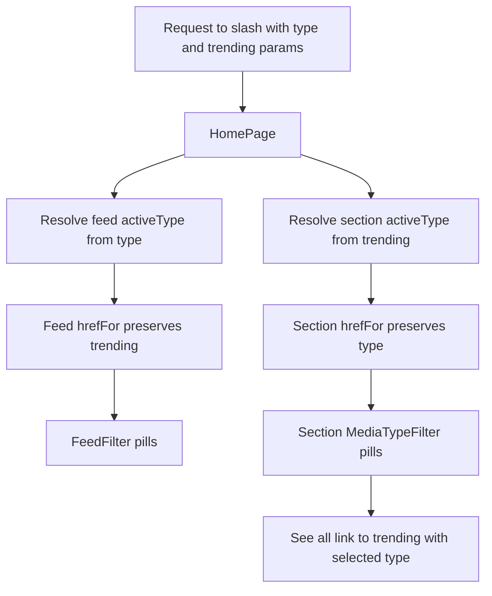

# Design Document

## Overview

**Purpose**: This feature delivers **media-type filtering parity** to LibraryLoop — a consistent "filter by media type" control on every media-list surface that currently lacks one (the Trending page, the Home Trending section, Wishlist, and Reviews), matching the experience already shipped on the Home feed and Library.

**Users**: Signed-in readers who browse media lists and want to focus on one kind (Books, Music, Podcasts, TV & Movies) at a time, on any surface.

**Impact**: Additive only. It reuses the existing **link-based, server-rendered, URL-as-state** filter pattern and the shared media-type helpers; it adds no endpoints, no database queries, and no external API calls. Filtering is an in-memory narrowing of data the page already loads. The existing Home feed and Library filters are refactored onto the same shared helpers without behavior change.

### Goals
- A single, reused filter control on the Trending page, Home Trending section, Wishlist, and Reviews.
- Data-driven options (only media types present on a surface) with a humanized label fallback, so new types/sources appear automatically.
- URL-addressable, refresh-safe, shareable selection that works without client JavaScript and is accessible.
- No regression to the Home feed or Library; trending remains a user-initiated "plain pull".

### Non-Goals
- Filtering by anything other than media type (no genre/source/status facets here).
- Server-side/DB query filtering or new endpoints (lists are already loaded in memory).
- Adding new trending media types or sources (the filter must merely scale to them).
- Persisting filter selection beyond the URL (no profile/preference storage — preserves `trending-now` 3.2).

## Architecture

### Existing Architecture Analysis
- **Pattern in place**: each surface is an App Router **server component** that loads its data, computes a media-type option set, resolves the active type from `searchParams`, filters in memory, and renders a `<Link>`-based pill nav (`MediaTypeFilter`) plus the list. Selection lives entirely in the URL query string.
- **Boundaries respected**: shared media-type logic lives in [src/lib/media-type.ts](../../../src/lib/media-type.ts); the filter UI is a presentational component; trending DTOs live in [src/lib/types/trending.ts](../../../src/lib/types/trending.ts) and are fetched via `fetchTrendingFeed`.
- **Integration points maintained**: `fetchTrendingFeed` is still called once with no type argument; `composeShelfItems`/`filterShelfItems` and `LibraryCard`/`TrendingCard` are unchanged.
- **Tech debt addressed**: `filterHref` is currently hard-coded to `/` and `mediaTypeCounts` only accepts `MediaItem[]`; both are generalized so a single implementation serves all surfaces.

### Architecture Pattern & Boundary Map

Selected pattern: **reuse the link-based URL-state filter**, extended to four surfaces with one shared component and shared helpers; per-surface server components own only their data loading and the in-memory filter step.



**Architecture Integration**:
- Selected pattern: server-rendered, link-based, URL-as-state filtering reusing shared utilities.
- Domain/feature boundaries: filtering logic in `lib`; one presentational filter component in `components/media`; trending transforms in `lib/trending`; each page owns only its wiring.
- Existing patterns preserved: `searchParams`-driven server components, `MediaTypeFilter` pills with `aria-current`, in-memory list filtering (as Library already does).
- New components rationale: a relocated shared `MediaTypeFilter` (clean boundary) and small pure trending-filter functions (testability); everything else is helper generalization.
- Steering compliance: additive and non-breaking, server-read, typed (no `any`), keeps `main` working.

### Technology Stack

| Layer | Choice / Version | Role in Feature | Notes |
|-------|------------------|-----------------|-------|
| Frontend | Next.js 15 App Router, React 19, TypeScript (strict) | Server components read `searchParams`; `<Link>`-based filter pills | No client components added |
| Frontend | Tailwind v4 + shadcn/ui | Existing pill styling via `MediaTypeFilter` | Reused as-is |
| Backend / Data | — | None | No endpoint, query, or schema change |

## System Flows

The only non-trivial flow is the Home route's two independent filters sharing one URL.



Key decisions: the feed uses the `type` param and the section uses the `trending` param; each control's links carry the other control's current value so selecting one never resets the other (Req 3.3). The section's "see all" link forwards its current selection to `/trending` (Req 3.4).

## Requirements Traceability

| Requirement | Summary | Components | Interfaces | Flows |
|-------------|---------|------------|------------|-------|
| 1.1, 1.2, 1.6, 1.7 | Consistent, data-driven control on all four surfaces; label fallback; no dead options | `MediaTypeFilter`, helpers | `countMediaTypes`, `mediaTypeLabel`, `MediaTypeFilterProps` | — |
| 1.3, 1.4, 1.5 | Default "All"; All shows all; specific shows matches | each page | `resolveActiveType`, in-memory filter | — |
| 2.1–2.4 | Trending page filter; hide empty groups; "All" unchanged; no re-query | Trending page, trending filter fns | `filterTrendingFeed`, `trendingMediaTypes` | — |
| 3.1–3.4 | Home section filter; independent of feed; deep-link via "see all" | Home page, `TrendingSection` | `typeFilterHrefFactory` (preserve), section props | Home dual-param flow |
| 4.1–4.3 | Wishlist filter scoped to wishlist items | Wishlist page | `mediaTypeCounts`, filter | — |
| 5.1–5.3 | Reviews filter scoped to reviewed items | Reviews page | `mediaTypeCounts`, filter | — |
| 6.1, 6.2 | URL-encoded, refresh-safe, shareable; unknown→All | helpers, pages | `typeFilterHrefFactory`, `resolveActiveType` | — |
| 6.3, 6.4 | Accessible active state; works without client JS | `MediaTypeFilter` | `aria-current`, `<Link>` | — |
| 6.5 | Per-surface empty state when filter matches nothing | each page | empty-state branch | — |
| 7.1, 7.2 | Consistent with, and non-regressive to, existing filters | helpers; Home feed + Library refactor | shared helpers | — |
| 7.3, 7.4 | Trending stays user-initiated; documentation note | Trending page; `trending-now` docs | — | — |

## Components and Interfaces

| Component | Domain/Layer | Intent | Req Coverage | Key Dependencies (P0/P1) | Contracts |
|-----------|--------------|--------|--------------|--------------------------|-----------|
| media-type helpers | lib | Generalized counts, active-type resolution, href factory | 1, 2, 4, 5, 6, 7 | `MediaItem`/string inputs (P0) | Service (pure) |
| trending filter fns | lib/trending | Pure filter of a `TrendingResponse` by media type | 2, 3 | `TrendingResponse` (P0) | Service (pure) |
| `MediaTypeFilter` (relocated) | components/media | Shared pill-nav filter control | 1, 6.3, 6.4, 7.1 | `next/link` (P0) | State (props) |
| Trending page | app/(app)/trending | Wire filter into the grouped feed | 2, 6 | helpers, trending fns, `MediaTypeFilter` (P0) | — |
| `TrendingSection` | components/trending | Filterable Home preview + deep-link | 3 | helpers, trending fns, `MediaTypeFilter` (P0) | State (props) |
| Home page | app/(app) | Resolve both params; wire independent controls | 3, 6, 7.2 | helpers, `TrendingSection` (P0) | — |
| Wishlist page | app/(app)/wishlist | Wire filter into wishlist list | 4, 6 | helpers, `MediaTypeFilter` (P0) | — |
| Reviews page | app/(app)/reviews | Wire filter into reviews list | 5, 6 | helpers, `MediaTypeFilter` (P0) | — |
| Library page (refactor) | app/(app)/library | Adopt shared helpers/import path | 7.1, 7.2 | helpers, `MediaTypeFilter` (P0) | — |

### lib

#### media-type helpers (generalization)

| Field | Detail |
|-------|--------|
| Intent | One implementation of counts, active-type resolution, and href building for every surface |
| Requirements | 1.2, 1.6, 1.7, 6.1, 6.2, 7.1 |

**Responsibilities & Constraints**
- Derive option sets from raw type strings so both `MediaItem.type` and `TrendingItem.mediaType` are supported.
- Build hrefs for any base path and, optionally, preserve sibling query params (Home dual-filter).
- Resolve an unknown/absent raw value to `"all"`.
- Backward compatible: existing `mediaTypeCounts(items)`, `mediaTypeOptions`, `mediaTypeLabel`, `distinctMediaTypes` keep their signatures.

**Contracts**: Service [x] / API [ ] / Event [ ] / Batch [ ] / State [ ]

##### Service Interface
```typescript
// Counts built from raw type strings; mediaTypeCounts(items) delegates here.
export function countMediaTypes(types: readonly string[]): MediaTypeCount[];

// Broadened to accept options or counts (anything carrying a string `value`).
export function resolveActiveType(
  raw: string | undefined,
  options: readonly { value: string }[],
): string;

// Build an hrefFor(value) for a given route/param, optionally preserving siblings.
export interface TypeHrefConfig {
  basePath: string;            // e.g. "/", "/trending", "/wishlist"
  param?: string;              // query key; defaults to "type"
  preserve?: Record<string, string | undefined>; // sibling params to keep
}
export function typeFilterHrefFactory(config: TypeHrefConfig): (value: string) => string;
```
- Preconditions: `basePath` is an app-relative path; `preserve` values are already-resolved active values.
- Postconditions: returned href omits the param when `value === "all"`; omits any preserved entry whose value is `undefined` or `"all"`; query values are URL-encoded; ordering is deterministic.
- Invariants: `resolveActiveType(x, opts)` ∈ `{ "all" } ∪ { o.value }`; no option is produced for a type absent from the input (Req 1.7).

**Implementation Notes**
- Integration: Home feed and Library are refactored to obtain `hrefFor` from `typeFilterHrefFactory` (single href implementation, Req 7.1) without changing their URLs.
- Validation: unknown raw values fall back to `"all"` (Req 6.2).
- Risks: Home feed href must now preserve `trending`; covered by tests (Req 7.2).

#### trending filter functions

| Field | Detail |
|-------|--------|
| Intent | Pure, in-memory narrowing of an already-fetched `TrendingResponse` by media type |
| Requirements | 2.1, 2.2, 2.3, 2.4, 3.1, 3.2 |

**Responsibilities & Constraints**
- Compute the set of media types present across `ok` sources' items (for options).
- Filter the feed: `"all"` returns it unchanged; a specific type keeps items whose `mediaType` matches and drops source groups left with no items (Req 2.2).
- Never trigger network calls — operate on the passed value only (Req 2.4).

**Contracts**: Service [x] / API [ ] / Event [ ] / Batch [ ] / State [ ]

##### Service Interface
```typescript
import type { TrendingResponse } from "@/lib/types";

// Distinct mediaType strings present across ok-source items, for option building.
export function trendingMediaTypes(feed: TrendingResponse): string[];

// "all" → feed unchanged; specific → matching items, empty source groups removed.
export function filterTrendingFeed(feed: TrendingResponse, type: string): TrendingResponse;
```
- Preconditions: `feed` is the value returned by `fetchTrendingFeed`.
- Postconditions: result `sources` for a specific type contain only `status === "ok"` groups with ≥1 matching item; `"all"` is referentially behavior-equivalent to the input.
- Invariants: item order within a source is preserved.

### components/media

#### MediaTypeFilter (relocated, unchanged contract)

| Field | Detail |
|-------|--------|
| Intent | Shared link-based pill nav for media-type selection |
| Requirements | 1.1, 1.5, 6.3, 6.4, 7.1 |

Summary-only (presentational, no new boundary). Moved from `components/library/` to `components/media/`; props are unchanged:

```typescript
export interface MediaTypeFilterProps {
  options: readonly MediaTypeCount[];
  activeValue: string;
  hrefFor: (value: string) => string;
  ariaLabel?: string;
}
```
**Implementation Note**: Each surface supplies `options` (via `countMediaTypes`/`mediaTypeCounts`), the resolved `activeValue`, an `hrefFor` from `typeFilterHrefFactory`, and a surface-specific `ariaLabel`. The Library import path is updated; any existing component test moves with it.

### Surface wiring (server components — summary-only)

All four pages follow the Library template: read `searchParams.type` (Home section reads `trending`), build options from the surface's own items, `resolveActiveType`, filter in memory, render `MediaTypeFilter` + list, and show an empty state when the filtered list is empty (Req 6.5).

- **Trending page** ([trending/page.tsx](../../../src/app/(app)/trending/page.tsx)): options from `trendingMediaTypes(feed)` with counts from `countMediaTypes(okItems.map(i => i.mediaType))`; render groups from `filterTrendingFeed(feed, activeType)`; source status notices show only when `activeType === "all"` (Req 2.2). `hrefFor = typeFilterHrefFactory({ basePath: "/trending" })`.
- **Home page** ([page.tsx](../../../src/app/(app)/page.tsx)): read both `type` and `trending`; feed `hrefFor = typeFilterHrefFactory({ basePath: "/", param: "type", preserve: { trending: activeTrending } })`; pass `activeTrending` + a section `hrefFor` (`param: "trending", preserve: { type: activeFeedType }`) to `TrendingSection`.
- **Home `TrendingSection`** ([TrendingSection.tsx](../../../src/components/trending/TrendingSection.tsx)): new props `activeType: string`, `hrefFor: (v: string) => string`; build options from its flattened items' `mediaType`, filter before slicing to the preview limit, render `MediaTypeFilter`; "see all" → `/trending?type=<activeType>` when not `"all"`, else `/trending` (Req 3.4). Returns `null` only when there are no items at all under the active selection.
- **Wishlist** ([wishlist/page.tsx](../../../src/app/(app)/wishlist/page.tsx)) / **Reviews** ([reviews/page.tsx](../../../src/app/(app)/reviews/page.tsx)): add `searchParams.type`; options from `mediaTypeCounts(items.map(({ item }) => item))` over the surface's items; filter visible items; load tags for the visible set; `hrefFor = typeFilterHrefFactory({ basePath: "/wishlist" | "/reviews" })`.

## Data Models

No domain, logical, or physical data-model changes. The feature operates on existing in-memory DTOs (`MediaItem`, `LibraryEntry`, `TrendingItem`/`TrendingResponse`) and the URL query string. `MediaTypeCount` (`{ value, label, count }`) is the only shared view-model and already exists.

## Error Handling

### Error Strategy
Filtering is total and side-effect-free; there are no new failure modes.

### Error Categories and Responses
- **User "errors" (bad/stale URL param)**: an unknown or absent `type`/`trending` value resolves to `"all"` (Req 6.2) — never an error page.
- **Empty result**: a valid type that matches nothing renders the surface's empty-state copy, not a blank list (Req 6.5).
- **System errors**: unchanged — trending source `unconfigured`/`error` notices keep their existing behavior in the `"all"` view; provider failures are still isolated per source by `fetchTrendingFeed`.

### Monitoring
No new monitoring; relies on existing request logging.

## Testing Strategy

### Unit Tests
- `countMediaTypes`: counts/labels/sort from raw type strings, including a label-fallback for an unknown type; empty input → just "All" with count 0.
- `typeFilterHrefFactory`: `"all"` → base path; specific → encoded param; `preserve` keeps a sibling param and drops it when `"all"`/undefined; custom `param` key.
- `resolveActiveType`: known value passes through; unknown/undefined → `"all"`; works with both `MediaTypeOption[]` and `MediaTypeCount[]`.
- `filterTrendingFeed` / `trendingMediaTypes`: `"all"` unchanged; specific type keeps matching items and drops empty groups; mixed-type sources; no-match → empty sources; order preserved.

### Component Tests (Testing Library)
- `MediaTypeFilter`: renders an option per input with counts; marks the active option `aria-current="true"`; each pill is an anchor with the expected `href`.
- `TrendingSection`: given multi-type items, selecting a type narrows the preview and the "see all" href carries the selection; renders the filter only when items exist.

### Non-regression
- Existing Home feed and Library filter tests remain green after the helper refactor and the `MediaTypeFilter` relocation (Req 7.2); add a case asserting the Home feed href preserves an active `trending` value.

## Security Considerations
No new auth, data exposure, or input surface beyond two reflected, allow-listed query params that are resolved against a data-derived option set (unknown → `"all"`); values are URL-encoded when emitted. The trending filter is strictly user-initiated and applies no profile-based logic, preserving `trending-now` Req 3.2 (Req 7.3). A clarifying note is added to the `trending-now` spec documenting that user-initiated filtering is distinct from profile-based filtering (Req 7.4).
