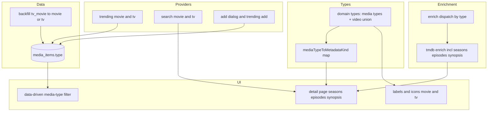
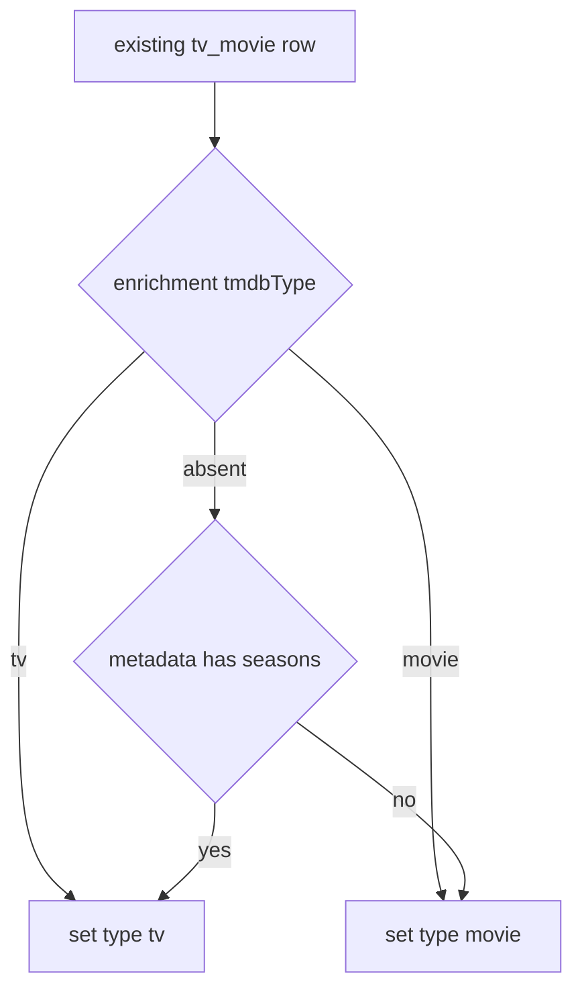
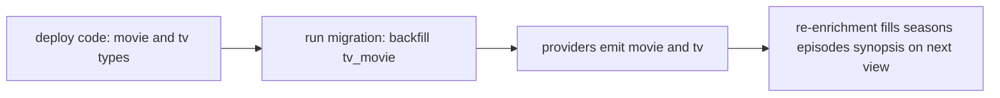

# Design Document

## Overview

**Purpose**: Promote Movies and TV Shows from the combined `tv_movie` media type to two first-class types (`movie`, `tv`), separately filterable everywhere, and deepen their detail page with TV season/episode counts and a TMDB synopsis.

**Users**: Readers gain independent Movies and TV Shows filters across every list and richer detail for film/TV items.

**Impact**: `item.type` gains `movie`/`tv`; a one-time backfill reclassifies existing `tv_movie` rows. The film/TV metadata/enrichment shape is retained as a single shared member renamed `video`, so the change is mechanical at the union layer and data-driven at the filter layer. Enrichment gains season/episode counts and a synopsis. Everything else (routes, auth, cover resolution, the enrichment resolve-and-cache flow) is preserved.

### Goals
- `movie` and `tv` are distinct types with their own labels/icons, filterable on every surface, with no per-type branching in shared filter UI.
- Providers (Trending, Search, add) emit the precise type; existing `tv_movie` rows are backfilled deterministically.
- TV detail shows season & episode counts; movies/TV show a synopsis; both keep taglines.
- No regressions; typecheck/test/build stay green; no `any`.

### Non-Goals
- No new providers, endpoints, or API keys (reuse TMDB + existing enrichment flow).
- No per-season episode-list UI beyond an optional bounded breakdown.
- No change to non-film/TV types, the de-dup key, or the enrichment endpoint contract.
- No retroactive re-typing on re-enrichment (the persisted type is authoritative once set).

## Architecture

### Existing Architecture Analysis
- **Media type** is an open string on `media_items.type`; the shared media-type filter is data-driven (`countMediaTypes(items.map(i => i.type))`), so new types need only labels + icons.
- **Discriminated unions** `MediaItemMetadata` / `MediaEnrichment` key on `kind`; parsers derive `kind` from the **type argument**, ignoring stored `kind` — so only the `type` column needs migrating, not jsonb `kind`.
- **Providers** already split movie/TV (Trending + Search each have two providers; enrichment records `tmdbType`).
- **Enrichment** uses the resolve-and-cache pattern (`enrichment` + `enrichment_checked_at`, idempotent service, `POST /api/enrichment`, `EnrichmentResolver`).

### Architecture Pattern & Boundary Map



**Architecture Integration**
- **Pattern**: keep the open media type as the user-facing axis (filters/labels/icons); keep a single shared `video` metadata/enrichment shape behind a central `mediaTypeToMetadataKind` map.
- **Preserved**: data-driven filter components, resolve-and-cache enrichment, boundary validation, cover resolution, the `ApiError` envelope, server/client boundaries.
- **New**: a hand-authored data migration; `movie`/`tv` labels & icons; season/episode + synopsis fields on the `video` enrichment shape.

### Technology Stack

| Layer | Choice | Role | Notes |
|-------|--------|------|-------|
| Data | PostgreSQL + Drizzle | `type` backfill migration | Custom SQL (no column change to diff) |
| Backend | TMDB via existing enrichment | seasons/episodes/synopsis | Reuse `covers/http.ts` + `TMDB_API_KEY` |
| Frontend | Next.js 15 / React 19 | labels, icons, detail rendering | Data-driven filter unchanged |

## System Flows

### Backfill classification (migration)



Key decisions: priority is resolved `tmdbType` → `seasons` hint → default `movie`. Library entries, reviews, tags, activity, and covers are untouched (only `type` changes), satisfying data preservation (4.5).

## Requirements Traceability

| Requirement | Summary | Components |
|-------------|---------|------------|
| 1.1–1.4 | First-class movie/tv types, labels/icons, data-driven, no combined chip | domain types, `media-type` labels, icon maps |
| 2.1–2.4 | Providers emit precise type; add picker split | trending/search tmdb providers, `AddItemDialog`, trending add |
| 3.1–3.4 | Separate filtering across all surfaces | data-driven `MediaTypeFilter` (unchanged), per-surface pages |
| 4.1–4.5 | Migration + backfill, preserve user data | data migration |
| 5.1–5.4 | TV season/episode capture + display, none for movies | tmdb enrich, `video` shape, `selectEnrichmentFields` |
| 6.1–6.4 | Synopsis capture + display, no duplication | tmdb enrich, detail page |
| 7.1–7.4 | Resilient, cached, validated, safe | enrichment flow, parser, detail render |
| 8.1–8.4 | Non-breaking, data-driven, green, no `any` | all |

## Components and Interfaces

| Component | Layer | Intent | Req | Contracts |
|-----------|-------|--------|-----|-----------|
| Media-type model + `mediaTypeToMetadataKind` | types | Add `movie`/`tv`; map types → shared `video` kind | 1, 8 | State |
| Labels & icons | UI/lib | "Movies"/"TV Shows" + Film/Tv icons; transitional `tv_movie` label | 1 | — |
| Movie/TV providers | providers | Emit precise `movie`/`tv` mediaType | 2 | Service |
| Add dialog | UI | Split picker into Movie / TV Show with the right fields | 2 | — |
| Data migration | data | Backfill `tv_movie` → `movie`/`tv` | 4 | Batch |
| TMDB enrich (extended) | enrichment | Add seasons/episodes (TV) + synopsis; type-directed endpoint | 5, 6, 7 | Service |
| `video` metadata/enrichment shape | types | Shared film/TV shape (renamed from `tv_movie`) | 5, 6 | State |
| Detail display | UI | Show seasons/episodes (TV), synopsis fallback | 5, 6 | — |

### Domain Model — media types and the shared `video` shape

```typescript
// Open media-type set gains movie/tv; tv_movie kept only as a tolerated legacy value.
// Closed metadata/enrichment discriminator: the film/TV member is renamed `video`.
export type MediaItemMetadata =
  | { kind: "ebook"; pages?: number }
  | { kind: "music"; album?: string }
  | { kind: "podcast"; show?: string; episodeCount?: number }
  | { kind: "video"; runtimeMinutes?: number; seasons?: number };

export type MediaEnrichment =
  | { kind: "video";
      tmdbId?: number; tmdbType?: "movie" | "tv";
      runtimeMinutes?: number; genres?: string[]; releaseDate?: string;
      tagline?: string; cast?: string[]; voteAverage?: number; voteCount?: number;
      seasons?: number; episodes?: number;   // TV only (present iff tmdbType === "tv")
      synopsis?: string;                      // TMDB overview
    }
  | { kind: "ebook"; /* …unchanged… */ }
  | { kind: "music"; /* … */ }
  | { kind: "podcast"; /* … */ };

// Central mapping from open media type → closed metadata/enrichment kind.
export function mediaTypeToMetadataKind(type: string):
  "ebook" | "music" | "podcast" | "video" | null;
//  movie → "video", tv → "video", tv_movie (legacy) → "video", others → self or null
```

- **Invariants**: parsers set `kind` from the type via `mediaTypeToMetadataKind` (never from stored jsonb). `seasons`/`episodes` are populated only for `tv` items, so movies render none (5.4). `synopsis` is display-fallback only.

### TrendingMediaType (closed union)
```typescript
export type TrendingMediaType = "ebook" | "music" | "podcast" | "movie" | "tv";
```
- The exhaustive icon `Record<TrendingMediaType, …>` must map `movie → Film`, `tv → Tv`. Search/trending provider `mediaType` literals change from `tv_movie` to `movie`/`tv`.

### TMDB enrichment (extended) — Service
```typescript
// normalizeTmdbDetail adds, for the video shape:
//   seasons?: number        // payload.number_of_seasons (tv only)
//   episodes?: number       // payload.number_of_episodes (tv only)
//   synopsis?: string       // payload.overview (movie + tv)
// enrichFromTmdb(item, deps): queries only the endpoint matching item.type
//   ("movie" | "tv"); legacy "tv_movie" tries movie then tv.
```
- Preconditions: `item.type ∈ {movie, tv, tv_movie}`. Postconditions: a `video` enrichment or null. Invariants: never throws; bounded fields; https links via `httpsOrNull`.

### Data Migration — Batch
- **Trigger**: applied by `drizzle-kit migrate` and the integration-test DB bootstrap.
- **Input/validation**: rows where `type = 'tv_movie'`.
- **Action** (single statement):
  ```sql
  UPDATE media_items SET type = CASE
    WHEN enrichment->>'tmdbType' = 'tv'   THEN 'tv'
    WHEN enrichment->>'tmdbType' = 'movie' THEN 'movie'
    WHEN metadata->>'seasons' IS NOT NULL  THEN 'tv'
    ELSE 'movie'
  END
  WHERE type = 'tv_movie';
  ```
- **Idempotency & recovery**: re-running is a no-op (no `tv_movie` rows remain); only `type` changes, so entries/reviews/tags/activity/cover are preserved (4.5). Hand-authored because there is no schema diff for `drizzle-kit generate`.

**Implementation Notes**
- Integration: seed data updated so Severance is `tv` and Arrival is `movie` (and their metadata uses the `video` kind). The add dialog offers "Movie"/"TV Show"; cover entities split to `movie: ["movie"]`, `tv: ["tvSeason"]`.
- Validation: external responses parsed via `isRecord`/typed coercion; `seasons`/`episodes` are non-negative ints; `synopsis` trimmed text.
- Risks: backfill default `movie` for type-less legacy rows (documented).

## Data Models

### Logical Data Model
- `media_items.type`: open text; canonical values now include `movie`, `tv` (was `tv_movie`). No column added/removed.
- `enrichment` jsonb (`$type<MediaEnrichment>()`): the `video` member gains `seasons`, `episodes`, `synopsis`. No schema change (jsonb), only shape evolution validated at the boundary.
- Migration changes only the `type` value of pre-existing `tv_movie` rows.

## Error Handling

### Error Strategy
Enrichment continues to degrade gracefully: provider failure → null/partial, never an exception; the detail page renders without seasons/episodes/synopsis when absent. The migration is a single deterministic statement; failure aborts the migration transaction (standard Drizzle behavior) without partial reclassification.

### Error Categories
- **Unknown/legacy type**: filters/labels keep the humanized fallback; transitional `tv_movie` label retained.
- **Provider unavailable/timeout**: unchanged resolve-and-cache degradation (7.2).
- **Malformed external JSON**: boundary guards drop the field (7.3).

## Testing Strategy

### Unit Tests
- `mediaTypeToMetadataKind`: movie/tv/tv_movie → `video`; others map or null.
- `parseMediaEnrichment`/`parseMediaMetadata`: `movie`/`tv` types yield the `video` shape; seasons/episodes/synopsis validated and bounded.
- `normalizeTmdbDetail`: TV payload yields seasons/episodes + synopsis; movie payload yields synopsis but no seasons/episodes.
- `selectEnrichmentFields`: TV shows Seasons/Episodes rows; movie omits them; synopsis handled.
- Search/trending tmdb providers emit `movie`/`tv` mediaType.

### Integration Tests (pglite, committed migration)
- The backfill migration reclassifies `tv_movie` rows by `tmdbType`, then `seasons`, else `movie`; library entries/reviews/tags survive (re-read after migration).
- Enrichment service still resolves/caches for `movie` and `tv` types.

### UI/Behaviour
- Media-type filter renders separate Movies and TV Shows chips from mixed data.
- Detail page: TV item shows season/episode counts and synopsis; movie shows synopsis only.

## Migration Strategy

- Single forward migration; structurally reversible (a down migration could re-collapse to `tv_movie`, though not required). Backfill is deterministic and idempotent.
