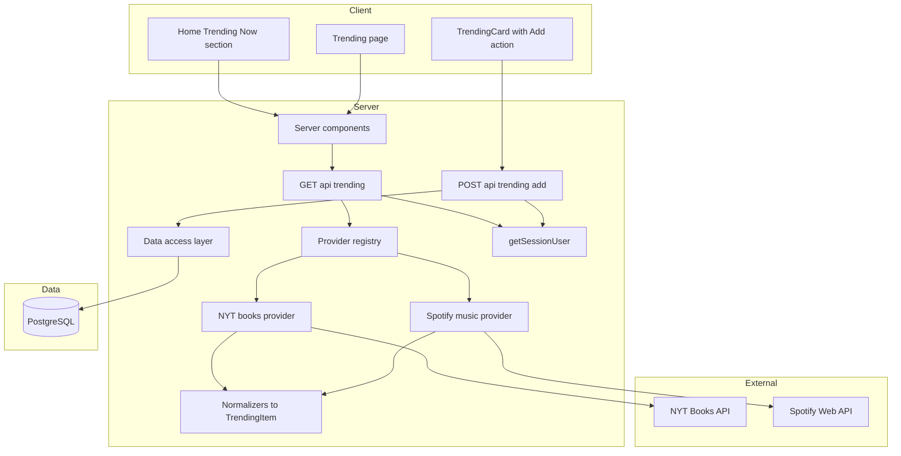
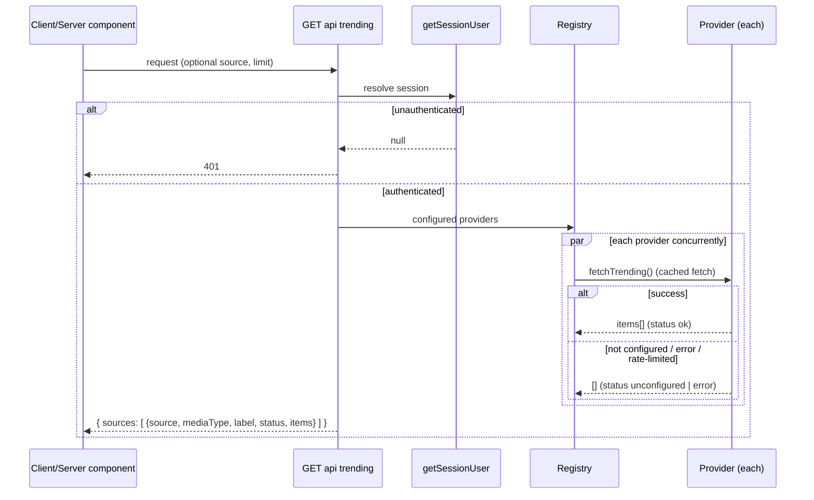

# Technical Design — trending-now

## Overview

**Purpose**: Trending Now adds external discovery to LibraryLoop — a feed of currently-popular media sourced live from third-party lists (NYT Best Sellers for books, Spotify New Releases for music), normalized into one shape and shown as a **Home "Trending Now" section** and a **dedicated `/trending` page**. Readers can add any trending item to their library.

**Users**: Signed-in readers browsing what's popular; maintainers who can add new sources without touching the feed/UI.

**Impact**: Additive to the shipped media-platform-v2 platform — a new **provider layer**, two authenticated **Route Handlers** (`/api/trending`, `/api/trending/add`), and new **surfaces** (Home section + `/trending` route + nav destination). No schema change: trending items are transient until added, which reuses the existing `media_items`/`library_entries` path. Supersedes the planned `nyt-recommendations` spec (NYT becomes the books provider). Auth/session/middleware, server/client boundaries, per-user authorization, and existing contracts are preserved; build/typecheck/tests stay green.

### Goals
- A pluggable **provider registry**: each source is an adapter normalized to a common `TrendingItem`; new providers need no feed/UI change.
- **Server-only** provider access with env-held secrets; **per-provider caching** within rate limits; **graceful per-provider degradation**.
- Surface trending on Home (compact) and a dedicated page (grouped by source); **add-to-library** with server-side de-dup.
- Retire `nyt-recommendations` by folding NYT in as the books provider.

### Non-Goals
- Spotify **user-OAuth library import** from Profile (authorization-code flow + token storage) — a later enhancement, explicitly out of scope.
- Personalized re-ranking/filtering of trending items (the pull is plain).
- Persisting external lists to the database; new media types beyond books/music in this slice (the registry stays open for more).

## Architecture

### Existing Architecture Analysis
- **Server-first layered app**: Server Components read via the DAL; Client Components mutate via Route Handlers gated by `getSessionUser()`; middleware gates routes by session cookie.
- **Reusable seams**: `src/db/queries.ts` (find-or-create media, `upsertEntryStatus`, `insertActivity`, `recordNewlyUnlocked`); `MediaCard`/`Badge`/`Card` design-system components; data-driven `NAV_ITEMS`; typed response helpers (`apiError`, `unauthorized`, …); `serverEnv()` (required vars only — provider keys are intentionally **optional**).
- **Constraints honored**: Drizzle-only DB access, no `any`, secrets server-side, no `dangerouslySetInnerHTML`, Node runtime for handlers, additive/non-breaking.

### Architecture Pattern & Boundary Map
**Pattern**: provider **registry + adapter** behind a single fan-out endpoint. Each external source implements a common `TrendingProvider` port; the endpoint runs configured providers concurrently and isolates each one's failure.



**Integration**:
- Selected pattern: registry + adapter — realizes pluggability (Req 2), degradation (Req 6), server-only typed access (Req 4), per-provider caching (Req 5).
- Boundaries: providers are pure-ish adapters (HTTP in → `TrendingItem[]` out) taking an injectable fetch for testability; the endpoint owns fan-out + isolation; add-to-library reuses the DAL.
- Preserved patterns: handler template, session-derived authorization, design-system rendering, data-driven nav.

### Technology Stack

| Layer | Choice / Version | Role | Notes |
|-------|------------------|------|-------|
| External | NYT Books API (list overview) | Books trending | One call → all lists; key `NYT_API_KEY` |
| External | Spotify Web API (New Releases) | Music trending | Client-credentials token; `SPOTIFY_CLIENT_ID/SECRET` |
| Backend | Next.js 15 Route Handlers (existing) | `/api/trending`, `/api/trending/add` | `runtime = "nodejs"`, session-gated |
| Caching | Next Data Cache (`fetch next.revalidate`) + in-memory token | Quota/rate-limit control | No new infra |
| Frontend | shadcn/ui + tokens (existing) | Trending surfaces + card | Reuse design system |
| Testing | Vitest + injectable fetch/mocks | Provider + endpoint tests | No live external calls |

No new runtime dependencies; uses the platform's existing stack + the global `fetch`.

## System Flows

### Trending fan-out with per-provider isolation (GET /api/trending)

One provider failing yields `status: "error"` for that source while others return `ok` (Req 6). Missing key → `status: "unconfigured"` (never an indefinite spinner).

### Add a trending item (POST /api/trending/add)
Session-gated → validate the trending payload → in a transaction: find-or-create media by (type, normalized title, creator) → `upsertEntryStatus` (default `wishlist`) → `insertActivity` → best-effort `recordNewlyUnlocked`; respond with the entry and whether the media already existed (Req 7).

## Requirements Traceability

| Requirement | Summary | Components | Interfaces |
|-------------|---------|------------|------------|
| 1.1–1.5 | Home section + `/trending` page + nav, gated | `TrendingSection`, `/trending` page, `NAV_ITEMS`, middleware | server props |
| 2.1–2.5 | Pluggable, normalized providers | `TrendingProvider`, registry, `TrendingItem` | port interface |
| 3.1–3.5 | Live, plain, grouped, de-duped | NYT + Spotify providers, normalizers, `TrendingCard` | `GET /api/trending` |
| 4.1–4.6 | Server-only, typed, auth, no proxy | both providers, `/api/trending` | token helper |
| 5.1–5.4 | Caching + rate limits | provider fetch (`revalidate`), token cache | — |
| 6.1–6.4 | Per-provider degradation | endpoint isolation, per-source status | `TrendingSourceResult` |
| 7.1–7.5 | Add to library + de-dup | `POST /api/trending/add`, DAL find-or-create | `AddTrendingRequest` |
| 8.1–8.4 | Loading/empty/error states | `TrendingSection`, page, `TrendingCard` | — |
| 9.1–9.5 | Config/secrets/local-dev | provider `isConfigured`, `.env.example`, README | — |
| 10.1–10.4 | Design system, responsive, a11y | trending components | — |
| 11.1–11.4 | Supersede nyt-recommendations | NYT provider, nav, spec metadata | — |
| 12.1–12.4 | Architecture/quality preserved | all (boundaries, types, tests) | — |

## Components and Interfaces

| Component | Layer | Intent | Req | Contracts |
|-----------|-------|--------|-----|-----------|
| `TrendingProvider` + registry | Domain | Pluggable source port + lookup | 2.1–2.3 | Service |
| NYT books provider | Integration | NYT overview → `TrendingItem[]` | 3.1, 4.x, 11.1 | Service |
| Spotify music provider | Integration | New Releases (client-creds) → `TrendingItem[]` | 3.1, 4.3 | Service |
| `GET /api/trending` | API | Fan-out, isolate, cache, typed envelope | 3,4,5,6 | API |
| `POST /api/trending/add` | API | De-duping add-to-library | 7 | API |
| Add/find DAL helper | Data | Type-scoped find-or-create match | 7.5 | Service |
| `TrendingSection` | UI | Home compact strip | 1.1, 7,8 | State |
| `/trending` page | UI | Full, source-grouped view | 1.2–1.4, 6, 8 | State |
| `TrendingCard` | UI | Item render + Add action | 3.5, 7, 8, 10 | State |
| `NAV_ITEMS` + middleware | UI | "Trending" destination, gating | 1.2, 1.5, 11.3 | — |

### Domain / Integration

#### Provider port, registry, and normalized item
**Responsibilities**: define the common shape every source maps to; declare a provider's media type, label, configuration check, and fetch; expose the configured set.

**Contracts**: Service [x]
```typescript
type TrendingMediaType = "ebook" | "music"; // open to more as providers are added

interface TrendingItem {
  source: string;          // provider id, e.g. "nyt", "spotify"
  sourceLabel: string;     // e.g. "NYT Best Sellers", "Spotify New Releases"
  mediaType: TrendingMediaType;
  title: string;
  creator: string;         // author / artist(s)
  listLabel: string;       // e.g. "Hardcover Fiction", "New Releases"
  rank: number | null;     // position within its list when applicable
  genre: string | null;
  artworkUrl: string | null; // https only
  externalUrl: string | null;
  externalId: string | null; // ISBN / Spotify id, for stable de-dup
}

interface TrendingProvider {
  readonly id: string;
  readonly label: string;
  readonly mediaType: TrendingMediaType;
  isConfigured(env: NodeJS.ProcessEnv): boolean;
  fetchTrending(opts: { limit: number; fetchImpl?: typeof fetch }): Promise<TrendingItem[]>;
}

const TRENDING_PROVIDERS: readonly TrendingProvider[] = [nytBooksProvider, spotifyMusicProvider];
```
- Preconditions: `fetchTrending` is called only when `isConfigured` is true.
- Postconditions: returns normalized, de-duped items (within the provider) or throws (the endpoint isolates throws).
- Invariants: providers never read the session or DB; they only fetch + normalize. `fetchImpl` injected for tests.

**Implementation Notes**
- **NYT**: `GET .../svc/books/v3/lists/overview.json?api-key=…` → `results.lists[].books[]`; normalize per book; de-dup across lists by `primary_isbn13` then normalized `title|author`; cache `fetch(..., { next: { revalidate: 3600 } })`.
- **Spotify**: obtain app token (`POST accounts.spotify.com/api/token`, Basic `id:secret`, memoized until ~60s pre-expiry) → `GET /v1/browse/new-releases?limit=N` → `albums.items[]`; normalize per album; cache the releases fetch similarly. Never expose the token.

#### `GET /api/trending`
**Contracts**: API [x]
| Method | Endpoint | Request | Response | Errors |
|--------|----------|---------|----------|--------|
| GET | /api/trending | query `?source=&limit=` | `TrendingResponse` | 401, 500 |

```typescript
type SourceStatus = "ok" | "unconfigured" | "error";
interface TrendingSourceResult {
  source: string; mediaType: TrendingMediaType; label: string;
  status: SourceStatus; items: TrendingItem[];
}
interface TrendingResponse { sources: TrendingSourceResult[] }
```
- Session-gated; runs configured providers via `Promise.allSettled`; a rejected/throwing provider → `status:"error"` with empty items; unconfigured providers → `status:"unconfigured"` (Req 6.1–6.3). `?limit=` bounds items per source (small for the Home section). Returns only normalized DTO fields, never raw upstream payloads or secrets (Req 4.6).

#### `POST /api/trending/add`
**Contracts**: API [x]
| Method | Endpoint | Request | Response | Errors |
|--------|----------|---------|----------|--------|
| POST | /api/trending/add | `AddTrendingRequest` | `{ entry: LibraryEntry; created: boolean; alreadyOwned: boolean }` | 400, 401, 500 |

```typescript
interface AddTrendingRequest {
  type: string; title: string; creator: string;
  genre?: string; status?: LibraryStatus;       // default "wishlist"
  metadata?: MediaItemMetadata | null;          // validated per type
  coverTheme?: string;
}
```
- Validate via a new `validateAddTrending` (reuses `parseMediaMetadata`, `isLibraryStatus`). In a transaction: type-scoped find-or-create media → `upsertEntryStatus` → `insertActivity` → best-effort `recordNewlyUnlocked`. `alreadyOwned` true when the user already had an entry for the matched media (Req 7.4); `created` reflects whether a new media row was inserted.

#### DAL addition
```typescript
// queries.ts (additive)
findMediaByTypeTitleCreator(db: DbExecutor, type: string, title: string, creator: string): Promise<MediaItem | null>;
```
Type-scoped match (normalized title+creator) so the same external item isn't duplicated across types (Req 7.5).

### UI layer (summary)
- **`TrendingCard`** (client): artwork (or themed fallback), source/list **Badge** + rank, title, creator, media-type indicator, and an **Add** button → `POST /api/trending/add` → `router.refresh()`; shows "In your library" when `alreadyOwned`. Built from existing `Card`/`Badge`/`Button`; status conveyed by text+icon, not color alone (Req 10.3, 13.5). Externally-sourced strings rendered as text; `artworkUrl` used only when https.
- **`TrendingSection`** (Home, server): fetches the trending data server-side with a small `limit`, renders a compact horizontally-scrollable strip across sources, with loading/empty handling; placed alongside the existing dashboard sections without removing them (Req 1.1, 7.4 of v2 retained).
- **`/trending` page** (server, in `(app)`): full view **grouped by source**, each group showing its `status` (healthy → cards; `unconfigured`/`error` → an accessible per-source notice), with an overall empty/error+retry path; `aria-current` nav active (Req 1.2–1.4, 6, 8).
- **Nav**: add `{ href: "/trending", label: "Trending", icon: "trending" }` to `NAV_ITEMS`; map `trending` → a lucide icon (e.g. `TrendingUp`). Middleware already gates non-auth/api paths, so `/trending` is protected automatically (Req 1.5).

## Data Models
No persistent schema change. `TrendingItem`/response types are transient DTOs in `src/lib/types`. Adding an item reuses `media_items` (find-or-create) + `library_entries` + `activities` via the DAL. `MediaItemMetadata` (from v2) carries type-specific fields when present.

## Error Handling
- **Endpoint**: reuse `unauthorized()`/`serverError()`. The fan-out never throws to the client for a single provider failure — it returns per-source `status` (Req 6). Total failure (all sources error) still returns `200` with all-error sources; the UI shows an error+retry state (Req 8.2), and other routes stay usable (Req 6.4).
- **Add**: `badRequest` on invalid payload; `serverError` on DB failure (transaction rolls back); unlock recording is best-effort (logged, never fails the add).
- **External**: provider adapters translate non-2xx/timeouts/rate-limit (429) into a thrown error caught by the fan-out; missing key short-circuits to `unconfigured`.

## Testing Strategy
- **Unit (pure)**: NYT and Spotify **normalizers** (overview/new-releases JSON → `TrendingItem[]`, incl. de-dup, missing-field tolerance, https artwork guard); `isConfigured` per provider.
- **Integration (mocked fetch)**: `/api/trending` with an injected fetch — success, one-provider-error isolation, unconfigured provider, `limit` bound; **no live external calls** (Req 12.3). `POST /api/trending/add` on pglite — create-then-dedup (second add → `alreadyOwned`), activity recorded, cross-user scoping.
- **UI**: `TrendingCard` renders source/rank/title/creator + Add control with an accessible name; per-source error/empty notices are text, not color-only.

## Security Considerations
- Provider keys read **only** server-side (`process.env`), never returned to the client or embedded in responses; Spotify token never leaves the server (Req 4.2–4.3). Endpoints are session-gated; add derives the user from the session (Req 4.4, 12.2). Adapters call only the specific upstream endpoints — no open proxy (Req 4.5). External text rendered as text; `artworkUrl` allowed only over https (Req 12.4). Keys stay optional in env so a missing key degrades a source rather than breaking boot (Req 6.3, 9.5).

## Migration / Supersession
- No DB migration. `nyt-recommendations` is **superseded**: set a `superseded_by: "trending-now"` note in its `spec.json` and a banner line atop its `requirements.md`; build no `/recommendations` route or `/api/recommendations`. The reserved "Recommendations" nav idea is realized as **Trending** (Req 11). NYT's substantive requirements (server-side key, plain all-lists pull, add-to-shelf) are preserved via the books provider.
