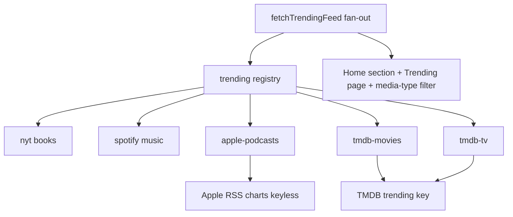
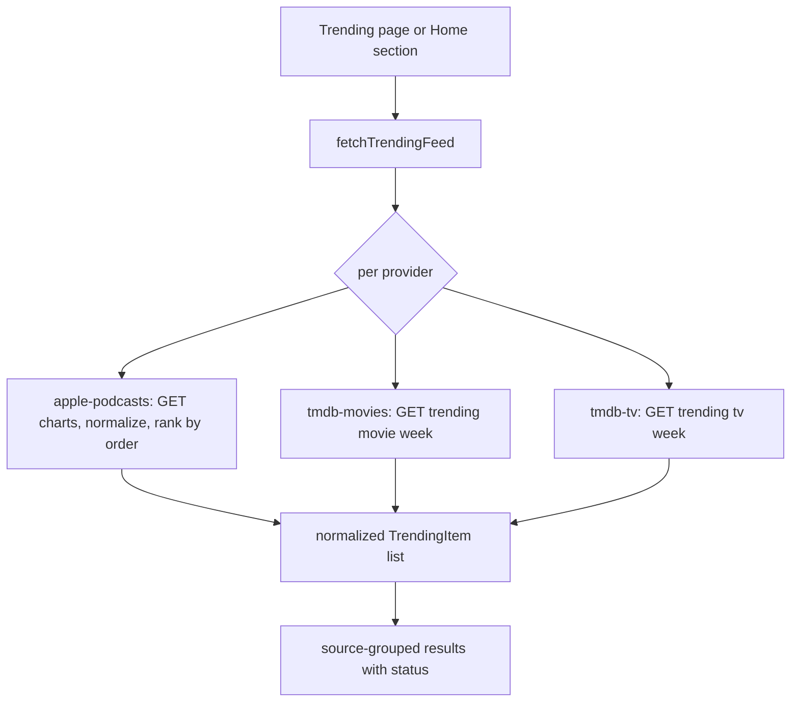

# Design Document

## Overview

**Purpose**: Complete the Trending Now feed by adding trending sources for **podcasts**, **TV shows**, and **movies**, so every supported media type (`ebook`, `music`, `podcast`, `tv_movie`) has a live source.

**Users**: Signed-in readers browsing the Home "Trending Now" section and the dedicated Trending page.

**Impact**: Additive. Three new providers register under the shipped `TrendingProvider` abstraction — **Apple Podcasts charts** (keyless) for `podcast`, and **TMDB** for `tv_movie` as two source groups (Trending Movies, Trending TV, keyed by `TMDB_API_KEY`). The only shared change is widening `TrendingMediaType` to include `"podcast"` and `"tv_movie"`. Because the fan-out, feed UI, media-type filter, add-to-library, and cover-art are all media-type-agnostic, the new types surface everywhere automatically with no feed/UI/card changes.

### Goals
- Trending podcasts (keyless) and TV/movies (TMDB, keyed) in the existing feed and page.
- New types appear in the media-type filter, are addable to the library, and show real cover art — with no new UI.
- Graceful per-source degradation and server-side caching, consistent with NYT/Spotify; existing providers untouched.

### Non-Goals
- New UI surfaces, cards, or feed/rendering changes.
- A new media type beyond the existing `tv_movie` (TV vs movie is a per-source label).
- Personalized/ranked trending (it stays a plain pull).
- Backfilling creator/cast for TV/movies (trending payload has none).

## Architecture

### Existing Architecture Analysis
- **Seam**: `TrendingProvider { id, label, mediaType, isConfigured(env), fetchTrending({limit, fetchImpl}) }` ([provider.ts](../../../src/lib/trending/provider.ts)); `registry.ts` lists providers; `feed.ts` runs them concurrently and maps missing-config→`unconfigured`, throw→`error`, else `ok`.
- **Patterns to mirror** (from `nyt.ts`/`spotify.ts`): a pure, unit-tested `normalize…` function; `httpsOrNull` validation; env secret read server-side; `fetch(url, { next: { revalidate } })` for the Data Cache; injectable `fetchImpl` for tests.
- **Downstream already type-agnostic**: `mediaTypeLabel` maps `podcast`→"Podcasts", `tv_movie`→"TV & Movies"; the trending media-type filter derives options from present types; `addTrendingItem`/`findOrCreateMedia` key on `(type, lower(title), lower(creator))` and persist `artworkUrl`; cover-art resolves/persists art for any type.

### Architecture Pattern & Boundary Map

Selected pattern: **new providers behind the existing port**; no orchestration changes.



**Architecture Integration**:
- Selected pattern: provider port + static registry (unchanged mechanics).
- Boundaries: each source is its own provider module in `lib/trending`; TMDB movies/tv share one client module; normalization is pure.
- Existing patterns preserved: timed/cached `fetch`, `httpsOrNull`, env-only secrets, per-source isolation, injectable fetch.
- New components rationale: one provider per source group; a widened media-type union; a new env var for TMDB.
- Steering compliance: server-side, secrets in env, https-only, additive, typed (no `any`).

### Technology Stack

| Layer | Choice | Role | Notes |
|-------|--------|------|-------|
| Domain | TypeScript providers in `lib/trending` | `apple-podcasts`, `tmdb-movies`, `tmdb-tv` + pure normalizers | mirror `nyt.ts` |
| Data/cache | Next Data Cache via `fetch(..., { next: { revalidate } })` | per-source caching within rate limits | as NYT/Spotify |
| Config | `TMDB_API_KEY` (env) | TMDB auth; absent ⇒ `unconfigured` | NYT/Spotify pattern |
| External | Apple RSS podcast charts (keyless); TMDB trending (keyed) | upstream popularity data | https only |

## System Flows

The fan-out is unchanged; the new providers slot in. Only TMDB's two-list merge is non-trivial:



Key decisions: each provider is isolated (one failing/unconfigured source never sinks the others); the TMDB key gates both TMDB providers; podcasts need no key.

## Requirements Traceability

| Requirement | Summary | Components |
|-------------|---------|------------|
| 1.1–1.4 | Podcast provider, normalized, attributed, ranked | `apple-podcasts` provider + `normalizeApplePodcasts` |
| 2.1–2.5 | TV/movie providers, normalized, attributed, movie/TV labels, ranked | `tmdb-movies`/`tmdb-tv` + `normalizeTmdb` |
| 3.1–3.4 | Server-side, env secret, unconfigured-when-absent, timeout/https | providers + `isConfigured`; `httpsOrNull` |
| 4.1–4.3 | Degradation, caching, empty state | existing fan-out + `next.revalidate` |
| 5.1–5.5 | Surfaces, filter, add, cover, no existing-provider change | registry + widened `TrendingMediaType` |
| 6.1–6.3 | Non-regression, plain pull, green gates | additive registry; tests w/ injected fetch |

## Components and Interfaces

| Component | Layer | Intent | Req | Contracts |
|-----------|-------|--------|-----|-----------|
| `TrendingMediaType` (widen) | types | Add `"podcast"`, `"tv_movie"` | 5 | State |
| `apple-podcasts` provider | lib/trending | Keyless podcast charts → items | 1, 3, 4 | Service |
| `tmdb` client + `tmdb-movies`/`tmdb-tv` providers | lib/trending | Keyed TV/movie trending → items | 2, 3, 4 | Service |
| registry (extend) | lib/trending | Register the three providers | 5.1 | — |
| env config (extend) | config | `TMDB_API_KEY` | 3.2 | — |

### types

#### TrendingMediaType (widen) — summary-only
`export type TrendingMediaType = "ebook" | "music" | "podcast" | "tv_movie";`. `TrendingItem.mediaType` / `TrendingSourceResult.mediaType` already reference it; no other shape change. Downstream labels/filter/add/cover already handle these values.

### lib/trending — apple-podcasts provider

| Field | Detail |
|-------|--------|
| Intent | Keyless trending podcasts from Apple's RSS charts |
| Requirements | 1.1, 1.2, 1.3, 1.4, 3.1, 3.3, 3.4, 4.x |

**Contracts**: Service [x]

##### Service Interface
```typescript
import type { TrendingItem } from "@/lib/types";
import type { TrendingProvider } from "./provider";

// Pure: Apple charts payload → normalized, capped items (rank = array order).
export function normalizeApplePodcasts(payload: unknown, limit: number): TrendingItem[];

export const applePodcastsProvider: TrendingProvider; // id "apple-podcasts", mediaType "podcast"
```
- `isConfigured`: always `true` (keyless).
- `fetchTrending`: `GET https://rss.marketingtools.apple.com/api/v2/us/podcasts/top/{N}/podcasts.json` (N = clamped limit), `next: { revalidate }`; throws on non-2xx (caller isolates).
- Normalize each `feed.results[i]` → `{ source: "apple-podcasts", sourceLabel: "Apple Podcasts", mediaType: "podcast", title: name, creator: artistName||"Unknown", listLabel: "Top Shows", rank: i+1, genre: genres[0]?.name ?? null, artworkUrl: httpsOrNull(artworkUrl100→600x600bb), externalUrl: httpsOrNull(url), externalId: id }`. Skip entries without a name; cap to `limit`.

### lib/trending — TMDB client + providers

| Field | Detail |
|-------|--------|
| Intent | Keyed trending movies and TV from TMDB, as two labeled source groups |
| Requirements | 2.1–2.5, 3.1–3.4, 4.x |

**Contracts**: Service [x]

##### Service Interface
```typescript
import type { TrendingItem } from "@/lib/types";
import type { TrendingProvider } from "./provider";

type TmdbKind = "movie" | "tv";
// Pure: TMDB trending payload → normalized, capped items for the given kind.
export function normalizeTmdb(payload: unknown, kind: TmdbKind, limit: number): TrendingItem[];

export const tmdbMoviesProvider: TrendingProvider; // id "tmdb-movies", label "Trending Movies"
export const tmdbTvProvider: TrendingProvider;      // id "tmdb-tv",     label "Trending TV"
```
- Both `mediaType: "tv_movie"`; `isConfigured`: `TMDB_API_KEY` present.
- `fetchTrending`: `GET https://api.themoviedb.org/3/trending/{kind}/week?api_key=…` with `next: { revalidate }`; throws on non-2xx.
- Normalize each `results[i]` → `{ source: id, sourceLabel: label, mediaType: "tv_movie", title: title||name, creator: "" , listLabel: kind==="movie"?"Trending Movies":"Trending TV", rank: i+1, genre: null, artworkUrl: poster_path ? httpsOrNull("https://image.tmdb.org/t/p/w500"+poster_path) : null, externalUrl: httpsOrNull("https://www.themoviedb.org/"+kind+"/"+id), externalId: kind+":"+id }`. Skip entries without a title/name.

**Implementation Notes (both providers)**
- Integration: mirror `nyt.ts` (env read server-side, `next.revalidate`, `httpsOrNull`, injectable `fetchImpl`); register all three in `registry.ts`.
- Validation: only https artwork/URLs surface; defensive string/number guards; malformed entries skipped.
- Risks: payload drift handled by guards; TMDB key absence → `unconfigured`.

## Data Models
No persistence changes. The transient `TrendingItem` shape is unchanged; only the `TrendingMediaType` union widens. When a reader adds one of these items, the existing `findOrCreateMedia` creates a `media_items` row of type `podcast`/`tv_movie` (persisting the provider `artworkUrl`) — using columns already present.

## Error Handling
- **Unconfigured (TMDB key absent)**: `isConfigured` false → both TMDB groups render the existing `unconfigured` notice; podcasts/books/music unaffected (Req 4.1, 3.3).
- **Upstream failure/timeout/non-2xx**: provider throws → fan-out marks that source `error`; others render (Req 4.1).
- **Empty results**: source returns `[]` → existing empty/again-later group state (Req 4.3).
- **Malformed entries**: skipped by the pure normalizers; never throw to the UI.

## Testing Strategy

### Unit Tests
- `normalizeApplePodcasts`: maps fields, rank = order, 100→600 artwork upscale, https validation, skips nameless entries, caps to limit, empty/malformed → `[]`.
- `normalizeTmdb`: `title` vs `name`, poster→`w500` https URL, `null` poster, `listLabel` per kind, rank order, skip title-less, cap.
- Provider `isConfigured`: `apple-podcasts` always true; TMDB true only with `TMDB_API_KEY`.
- `fetchTrending` with injected `fetchImpl`: builds the right URL (count/kind/`api_key`), returns normalized items, throws on non-2xx — no live network.

### Integration / Non-regression
- `registry` includes the three new providers; `fetchTrendingFeed` (with injected providers/env/fetch) yields `unconfigured` for TMDB without a key and `ok` for podcasts (Req 4.1, 6.1).
- Type-check/build confirm the widened union flows through filter/add/cover with no other change; existing NYT/Spotify provider tests stay green (Req 6.3).

## Security Considerations
TMDB key lives in env and is read server-side only (never sent to the browser); Apple charts are keyless. All upstream calls are server-side via the existing endpoint; only https artwork/external URLs are surfaced (`httpsOrNull`). No new user-data handling. Trending stays a plain, user-initiated pull (Req 6.2).

## Performance & Scalability
Each source is cached via `next.revalidate` (consistent with NYT/Spotify), so repeated views avoid redundant upstream calls; TMDB adds two cached calls (movie+tv) only when configured. The fan-out runs providers concurrently and isolates slow/erroring ones, so adding sources does not degrade the feed.
